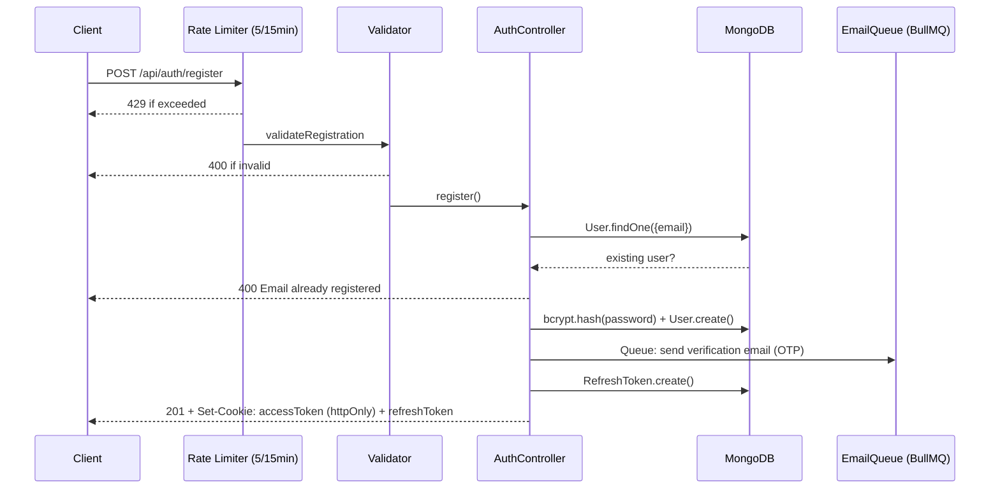
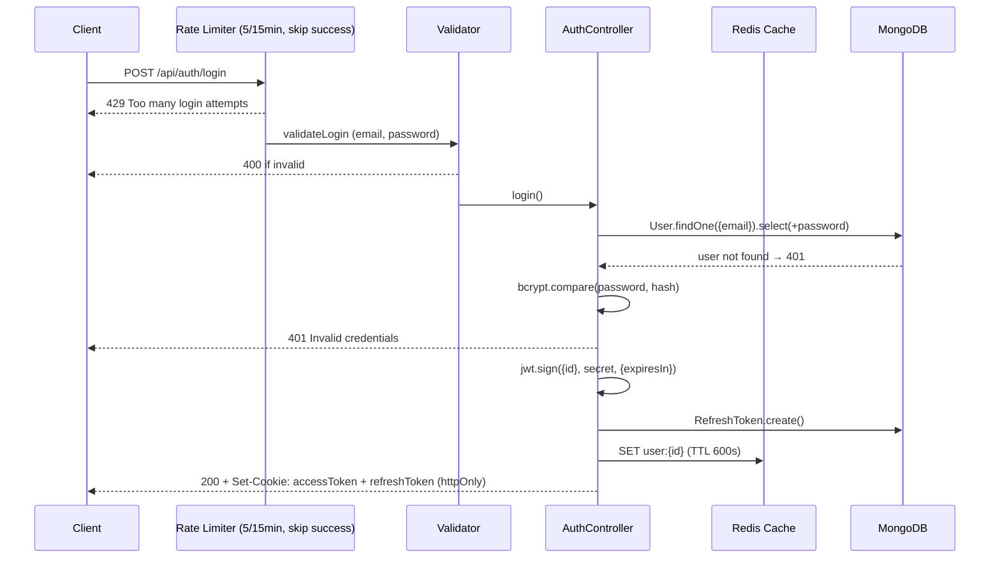
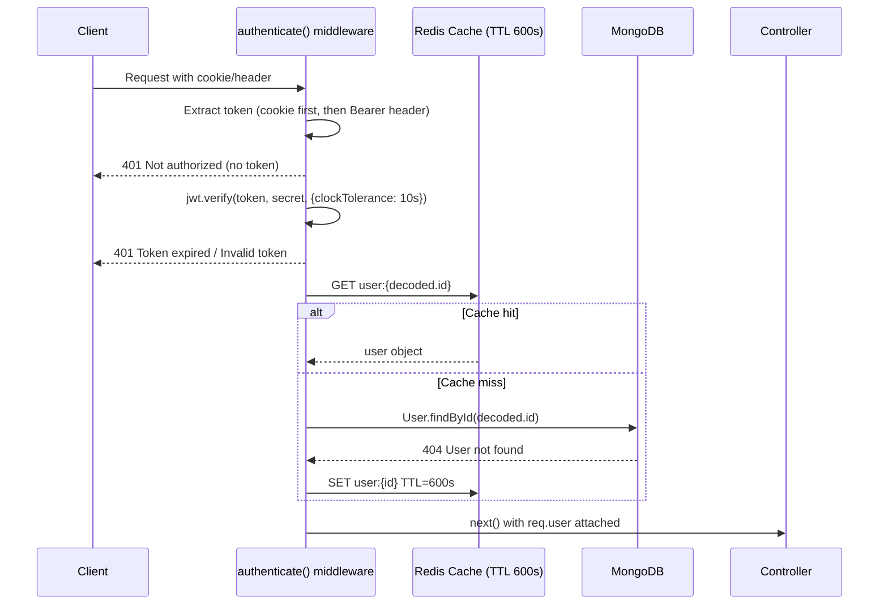
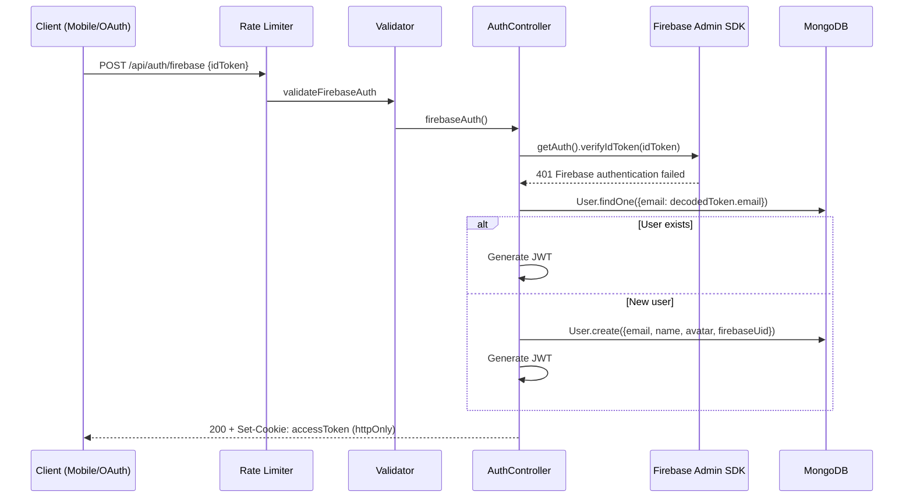
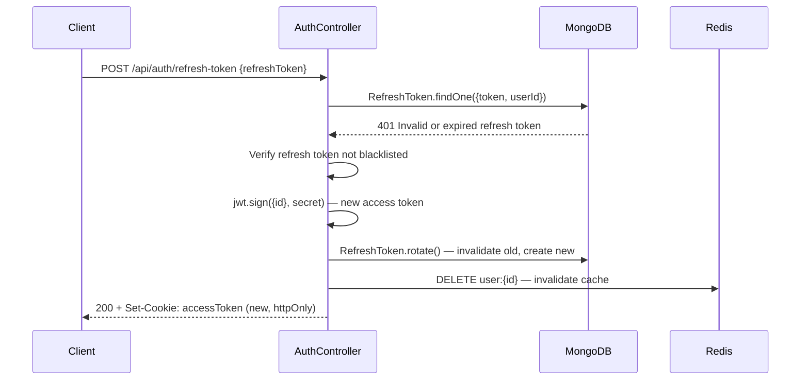
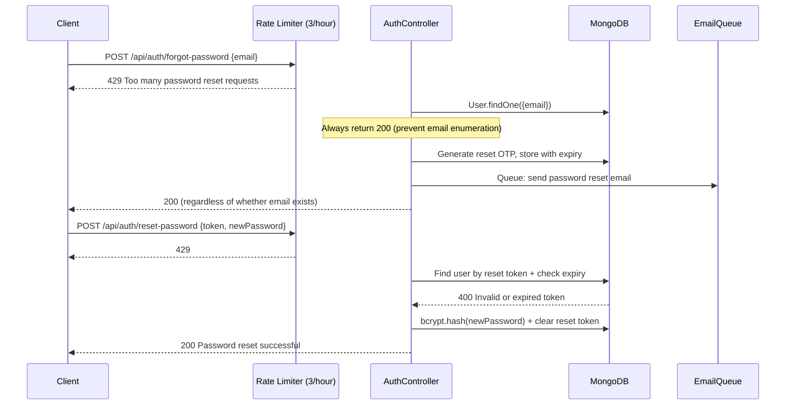
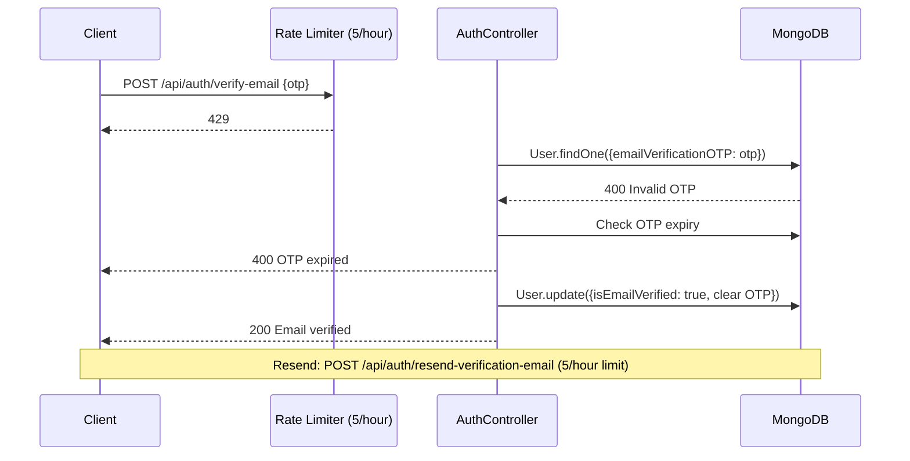
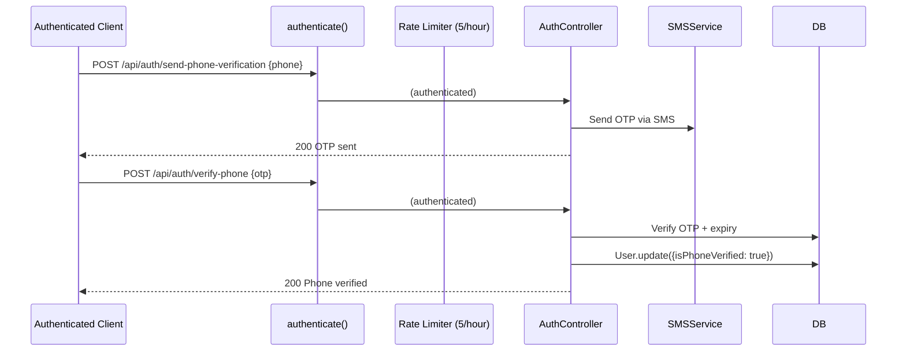

# Authentication Flow

> Gema Event Management Platform
> Generated: 2026-02-25

---

## 1. Registration Flow



---

## 2. Login Flow



---

## 3. Request Authentication Flow



---

## 4. Firebase Authentication Flow



---

## 5. Token Refresh Flow



---

## 6. Password Reset Flow



---

## 7. Email Verification Flow



---

## 8. Phone Verification Flow



---

## 9. Authorization Middleware

```mermaid
flowchart TD
    A[Incoming Request] --> B{authenticate()}
    B -->|No token| C[401 Not authorized]
    B -->|Token invalid| D[401 Invalid token]
    B -->|Token expired| E{How old?}
    E -->|>1 day| F[401 Expired N days ago, re-login]
    E -->|<1 day| G[401 Use /refresh-token]
    B -->|Token valid| H[req.user attached]
    H --> I{authorize(roles)?}
    I -->|No role requirement| J[Controller]
    I -->|Role matches| J
    I -->|Role mismatch| K[403 Not authorized for this action]
    K --> L[Log warn: endpoint + userRole + userId]
```

---

## 10. API Endpoints Summary

| Method | Endpoint | Auth | Rate Limit |
|--------|----------|------|-----------|
| POST | `/api/auth/register` | Public | authLimiter (5/15min) |
| POST | `/api/auth/login` | Public | authLimiter (5/15min, skip success) |
| POST | `/api/auth/logout` | Public | none |
| POST | `/api/auth/refresh-token` | Public | none |
| GET | `/api/auth/me` | Optional | none |
| GET | `/api/auth/profile` | Required | none |
| PUT | `/api/auth/profile` | Required | none |
| PUT | `/api/auth/change-password` | Required | none |
| POST | `/api/auth/forgot-password` | Public | passwordResetLimiter (3/hour) |
| POST | `/api/auth/reset-password` | Public | passwordResetLimiter (3/hour) |
| POST | `/api/auth/verify-email` | Public | emailVerificationLimiter (5/hour) |
| POST | `/api/auth/resend-verification-email` | Public | emailVerificationLimiter (5/hour) |
| POST | `/api/auth/firebase` | Public | authLimiter (5/15min) |
| POST | `/api/auth/addresses` | Required | none |
| PUT | `/api/auth/addresses/:index` | Required | none |
| DELETE | `/api/auth/addresses/:index` | Required | none |
| POST | `/api/auth/send-phone-verification` | Required | emailVerificationLimiter |
| POST | `/api/auth/verify-phone` | Required | emailVerificationLimiter |
| POST | `/api/auth/resend-phone-verification` | Required | emailVerificationLimiter |
