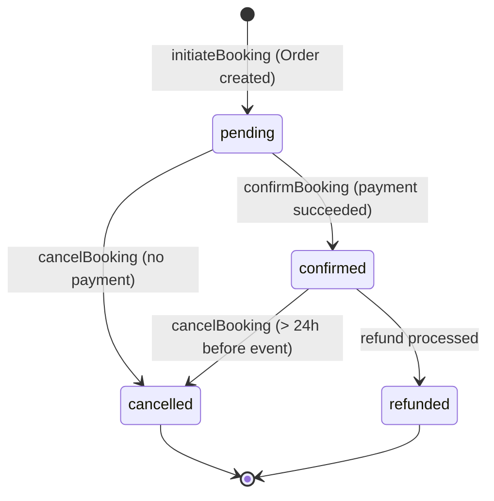
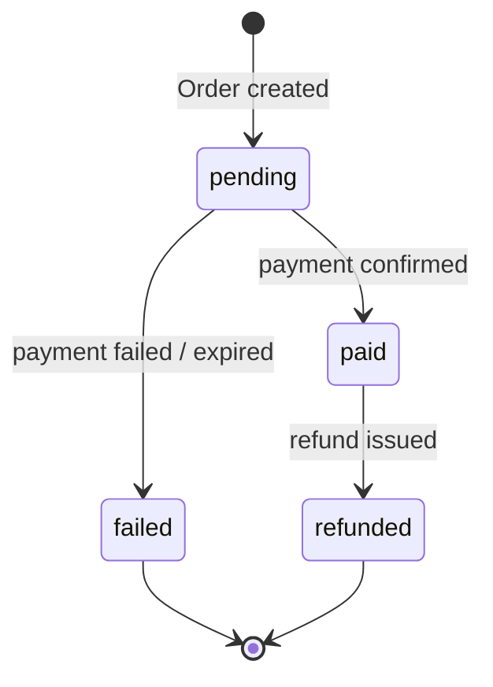

# Booking Flow — Gema Event Management Platform

Generated: 2026-02-25

---

## Table of Contents

1. [Sequence Diagram — Full Booking Flow](#1-sequence-diagram--full-booking-flow)
2. [Flowchart — Business Logic Decisions](#2-flowchart--business-logic-decisions)
3. [Step-by-Step Flow Description](#3-step-by-step-flow-description)
4. [Edge Cases and Error Paths](#4-edge-cases-and-error-paths)
5. [Key Data Models](#5-key-data-models)

---

## 1. Sequence Diagram — Full Booking Flow

The sequence covers both phases: **initiation** (seat reservation + payment setup) and **confirmation** (payment verification + ticket generation).

```mermaid
sequenceDiagram
    actor User
    participant FE as Frontend (React)
    participant MW as Middleware (Auth + Phone)
    participant BC as BookingController
    participant PS as PaymentService
    participant CS as CouponService
    participant DB as MongoDB
    participant Redis
    participant Stripe
    participant TGS as TicketGenerationService
    participant Email as EmailService

    %% ─── PHASE 1: INITIATE BOOKING ───────────────────────────────────────────
    Note over User,Email: Phase 1 — Initiate Booking (POST /api/bookings/initiate)

    User->>FE: Select event, schedule, seat count
    FE->>MW: POST /api/bookings/initiate (JWT in cookie/header)
    MW->>MW: authenticate() — verify JWT, load user from Redis/DB
    MW->>MW: conditionalPhoneVerification() — check global + event settings
    MW->>MW: express-validator — validate eventId, dateScheduleId, seats (1–10), paymentMethod
    MW->>BC: Pass validated request

    BC->>DB: EventModel.findOne({ _id, isApproved: true, isDeleted: false })
    DB-->>BC: Event document (or null)

    BC->>BC: Find dateSchedule by dateScheduleId
    BC->>BC: Resolve scheduleDate (startDate ?? date field)
    BC->>BC: Validate scheduleDate is a valid Date object

    alt Seats not unlimited
        BC->>DB: EventModel.findOneAndUpdate (atomic $inc availableSeats -= seats,<br/> condition: availableSeats >= seats)
        DB-->>BC: Updated event (or null if insufficient)
    else Unlimited seats
        BC->>BC: Skip capacity check — log info
    end

    BC->>DB: User.findById(userId).lean()
    DB-->>BC: User document

    BC->>PS: getPaymentRouting(vendorOrTeacherId, 0)
    PS->>DB: Vendor.findById() or Teacher.findById()
    DB-->>PS: Vendor/Teacher with paymentSettings
    PS->>PS: Determine: CUSTOM_STRIPE + active subscription + Stripe creds?
    PS-->>BC: PaymentRoutingInfo { usesVendorStripe, vendorStripeAccountId, ... }

    BC->>DB: AdminRevenueSettings.findOne({}).lean()
    DB-->>BC: serviceFeeRate, taxRate

    BC->>BC: unitPrice = schedule.price ?? event.price
    BC->>BC: subtotal = unitPrice * seats

    opt Coupon code provided
        BC->>CS: CouponService.validateCoupon(code, userId, subtotal, [eventId])
        CS->>DB: Coupon lookup + usage validation
        DB-->>CS: Coupon document
        CS-->>BC: { discountAmount, coupon.code }
    end

    BC->>BC: serviceFee = (subtotal - couponDiscount) * serviceFeeRate / 100
    BC->>BC: tax = (subtotal - couponDiscount + serviceFee) * taxRate / 100
    BC->>BC: total = subtotal - couponDiscount + tax + serviceFee

    BC->>DB: new Order({ status: pending, paymentStatus: pending, ... }).save(session)
    DB-->>BC: Saved Order (_id, orderNumber GM-XXXXX)

    alt paymentMethod === 'test'
        BC->>BC: Generate mock paymentIntentId = "test_pi_{orderId}"
    else paymentMethod === 'stripe'
        BC->>PS: createPaymentIntent({ amount, currency, orderId, vendorId, metadata })
        PS->>Stripe: stripe.paymentIntents.create(...)
        Stripe-->>PS: PaymentIntent { id, client_secret }
        PS-->>BC: { paymentIntentId, clientSecret }
    end

    BC->>DB: order.paymentIntentId = paymentIntentId; order.save(session)
    BC->>BC: session.commitTransaction()

    alt Seats not unlimited
        BC->>Redis: SET seat-hold:{orderId} { eventId, dateScheduleId, seats } EX 900
        Redis-->>BC: OK
    end

    BC-->>FE: 201 { orderId, paymentIntentId, clientSecret, amount, expiresAt (+15 min) }
    FE->>User: Show payment form with clientSecret

    %% ─── PHASE 2: CONFIRM BOOKING ────────────────────────────────────────────
    Note over User,Email: Phase 2 — Confirm Booking (POST /api/bookings/confirm)

    User->>FE: Complete Stripe payment (card entry)
    FE->>MW: POST /api/bookings/confirm { paymentIntentId, orderId }
    MW->>MW: authenticate() + conditionalPhoneVerification()
    MW->>MW: express-validator — validate paymentIntentId (notEmpty), orderId (MongoId)
    MW->>BC: Pass validated request

    BC->>DB: Order.findById(orderId).populate(items.eventId)
    DB-->>BC: Order document

    alt paymentIntentId starts with "test_pi_"
        BC->>BC: Mock paymentIntent { status: succeeded, payment_method: test }
    else Real Stripe payment
        BC->>PS: getPaymentIntent(paymentIntentId)
        PS->>Stripe: stripe.paymentIntents.retrieve(id)
        Stripe-->>PS: PaymentIntent
        PS-->>BC: PaymentIntent { status, amount, currency }
        BC->>BC: Assert status === "succeeded"
    end

    BC->>DB: order.status = confirmed; order.paymentStatus = paid;<br/>order.confirmedAt = now; order.transactionId = paymentIntent.id; order.save()
    DB-->>BC: Saved

    BC->>Redis: DEL seat-hold:{orderId}
    Redis-->>BC: OK

    BC->>TGS: generateTicketsForOrder(orderId, { sendEmail: true, skipExisting: false })
    TGS->>DB: Order.findById(orderId).populate(items.eventId)
    loop Per order item × quantity
        TGS->>TGS: generateUniqueTicketNumber() via UUID + uniqueness check
        TGS->>TGS: generateSecureQRData(ticketNumber, eventId, orderId)
        TGS->>TGS: generateQRCode(qrData) → base64 PNG
        TGS->>DB: new Ticket({ ticketNumber, qrCodeImage, status: active, ... }).save()
    end
    TGS->>Email: sendTicketByEmail(user, tickets, event)
    Email-->>TGS: Sent
    TGS-->>BC: TicketGenerationResult { success, tickets[], totalGenerated }

    BC->>DB: EventModel.findById(firstItem.eventId).populate(vendorId)
    BC->>DB: User.findById(vendor.id).lean()
    BC->>DB: User.findById(order.userId).lean()
    BC->>Email: emailService.sendVendorBookingNotificationEmail(vendorEmail, ...)
    Email-->>BC: Sent

    BC->>DB: order.addCommunication(email, ...); order.save()

    BC-->>FE: 200 { bookingId, eventTitle, date, seats, amountPaid, status, tickets[] }
    FE->>User: Show booking confirmation + ticket QR codes
```

---

## 2. Flowchart — Business Logic Decisions

```mermaid
flowchart TD
    A([User submits booking request]) --> B{JWT valid?}
    B -- No --> ERR1([401 Unauthorized])
    B -- Yes --> C{Phone verified?\nif required}
    C -- No --> ERR2([403 Phone verification required])
    C -- Yes / Not required --> D{Input valid?\neventId, dateScheduleId,\nseats 1-10, paymentMethod}
    D -- No --> ERR3([400 Validation failed])
    D -- Yes --> E[Fetch Event from DB\nisApproved=true, isDeleted=false]

    E --> F{Event found?}
    F -- No --> ERR4([404 Event not found])
    F -- Yes --> G[Find dateSchedule by ID]

    G --> H{Schedule exists?}
    H -- No --> ERR5([404 Schedule not found])
    H -- Yes --> I{scheduleDate valid\nDate object?}
    I -- No --> ERR6([400 Invalid date])
    I -- Yes --> J{Unlimited seats?}

    J -- Yes --> K[Skip capacity check]
    J -- No --> L[Atomic DB update:\nfind where availableSeats >= seats\n$inc availableSeats -= seats]

    L --> M{Sufficient seats?}
    M -- No --> ERR7([400 Insufficient seats])
    M -- Yes --> K

    K --> N[Fetch User from DB]
    N --> O{User found?}
    O -- No --> ERR8([404 User not found\n+ restore seats])
    O -- Yes --> P[Resolve vendorId or teacherId\nfrom event]

    P --> Q{vendorId or\nteacherId present?}
    Q -- No --> ERR9([500 Event config error])
    Q -- Yes --> R[PaymentService.getPaymentRouting]

    R --> S{Vendor uses\nCustom Stripe +\nactive subscription?}
    S -- Yes --> T[serviceFeeRate = 0\nNo platform commission]
    S -- No --> U[serviceFeeRate from\nAdminRevenueSettings\ndefault 5%]

    T --> V[Fetch AdminRevenueSettings\ntaxRate default 5%]
    U --> V

    V --> W{Coupon code\nprovided?}
    W -- Yes --> X[CouponService.validateCoupon\ncheck: active, not expired,\nusage limit, event eligibility]
    X --> Y{Coupon valid?}
    Y -- No --> ERR10([400 Invalid coupon\n+ restore seats])
    Y -- Yes --> Z[Apply couponDiscount]
    W -- No --> Z2[couponDiscount = 0]

    Z --> AA[Calculate fees:\nserviceFee = subtotal-discount × rate\ntax = base+fee × taxRate\ntotal = subtotal - discount + tax + fee]
    Z2 --> AA

    AA --> AB[Start Mongoose session\nBegin transaction]
    AB --> AC[Create Order in DB\nstatus=pending, paymentStatus=pending]

    AC --> AD{paymentMethod\n=== test?}
    AD -- Yes --> AE[Generate mock paymentIntentId\ntest_pi_{orderId}]
    AD -- No --> AF[PaymentService.createPaymentIntent\nStripe API call]

    AF --> AG{Stripe API\nsucceeded?}
    AG -- No --> ERR11([500 Payment init failed\n+ rollback + restore seats])
    AG -- Yes --> AH[paymentIntentId returned]

    AE --> AH
    AH --> AI[Update Order with paymentIntentId\nCommit transaction]

    AI --> AJ{Seats not\nunlimited?}
    AJ -- Yes --> AK[Redis SET seat-hold:{orderId}\nTTL 900s / 15 min]
    AJ -- No --> AL
    AK --> AL[Return 201:\norderId, clientSecret,\namount, expiresAt]

    AL --> AM([User enters card details\nin Stripe Elements])
    AM --> AN[Frontend submits\nPOST /api/bookings/confirm]

    AN --> AO{Order exists?}
    AO -- No --> ERR12([404 Order not found])
    AO -- Yes --> AP{Test payment?}

    AP -- Yes --> AQ[Mock: status=succeeded]
    AP -- No --> AR[PaymentService.getPaymentIntent\nfrom Stripe]

    AR --> AS{Payment status\n=== succeeded?}
    AS -- No --> ERR13([400 Payment not completed\nstatus: <current_status>])
    AS -- Yes --> AQ

    AQ --> AT[Update Order:\nstatus=confirmed\npaymentStatus=paid\nconfirmedAt=now\ntransactionId=paymentIntent.id]

    AT --> AU[Redis DEL seat-hold:{orderId}]
    AU --> AV[TicketGenerationService\ngenerateTicketsForOrder]

    AV --> AW{Tickets\ngenerated OK?}
    AW -- Partial failure --> AX[Log warnings\nbut do not fail request]
    AW -- Yes --> AX

    AX --> AY[Send customer ticket email]
    AY --> AZ[Send vendor booking\nnotification email]
    AZ --> BA[Log communication on Order]

    BA --> BB([Return 200:\nbookingId, tickets, status=confirmed])
```

---

## 3. Step-by-Step Flow Description

### Phase 1: Initiate Booking

**Step 1 — Authentication and authorization**

Every booking request passes through two middleware layers before reaching the controller. `authenticate()` verifies the JWT (from the `Authorization` header or an httpOnly cookie) and loads the user record from a Redis cache, falling back to MongoDB on a cache miss. `conditionalPhoneVerification()` then checks whether the platform global setting or the specific event requires phone number verification; if it does and the user has not verified, the request is rejected immediately.

**Step 2 — Input validation**

`express-validator` validates the four required fields: `eventId` (must be a valid Mongo ObjectId), `dateScheduleId` (Mongo ObjectId), `seats` (integer 1–10), and an optional `paymentMethod` enum (`stripe`, `paypal`, or `test`).

**Step 3 — Event and schedule lookup**

The controller fetches the event with conditions `isApproved: true` and `isDeleted: false` to ensure only live, approved events can be booked. It then searches `event.dateSchedule` for the matching schedule. The schedule date is resolved with backward compatibility: it prefers `schedule.startDate` and falls back to the legacy `schedule.date` field.

**Step 4 — Atomic seat reservation**

For events with limited capacity, the controller uses a single `findOneAndUpdate` call with `$gte` and `$inc` operators. This is an atomic MongoDB operation — it simultaneously checks availability and decrements the counter, preventing race conditions under concurrent bookings. If the query returns `null`, the requested seats are no longer available.

**Step 5 — Payment routing determination**

`PaymentService.getPaymentRouting()` inspects the vendor or teacher's payment settings. If the vendor uses their own Stripe account (`CUSTOM_STRIPE` mode) and has an active subscription, payments go directly to their account with zero platform commission. Otherwise, the platform Stripe account is used and a commission (default 5%) is charged as a service fee.

**Step 6 — Fee calculation**

All fees are calculated in AED. The breakdown is:
- `subtotal = unitPrice × seats`
- `couponDiscount` — applied if a valid coupon code was provided
- `serviceFee = (subtotal - couponDiscount) × serviceFeeRate / 100`
- `tax = (subtotal - couponDiscount + serviceFee) × taxRate / 100`
- `total = subtotal - couponDiscount + tax + serviceFee`

**Step 7 — Order creation and payment intent**

The controller opens a Mongoose session and runs a transaction. The Order is persisted first with `status: pending` and `paymentStatus: pending`. A Stripe `PaymentIntent` is then created with the computed total, event metadata, and vendor routing info. On success the `paymentIntentId` is written back to the Order and the transaction is committed.

**Step 8 — Seat hold in Redis**

A Redis key `seat-hold:{orderId}` is written with a 15-minute TTL. This key carries the reservation context (`eventId`, `dateScheduleId`, `seats`). If the user abandons checkout, a background job can use this key to release the held seats.

**Step 9 — Response to frontend**

The controller returns HTTP 201 with the `orderId`, Stripe `clientSecret` (used by Stripe.js to render the payment form), the computed amounts, and an `expiresAt` timestamp 15 minutes in the future — matching the seat hold TTL.

---

### Phase 2: Confirm Booking

**Step 10 — Payment verification**

After the user completes card entry in Stripe Elements, the frontend calls `POST /api/bookings/confirm` with the `paymentIntentId` and `orderId`. The controller retrieves the `PaymentIntent` from Stripe and verifies its `status` equals `succeeded`. Test payments are detected by the `test_pi_` prefix and bypass the Stripe call.

**Step 11 — Order status update**

The Order document is updated synchronously: `status → confirmed`, `paymentStatus → paid`, `confirmedAt` is stamped, and `transactionId` is set to the Stripe intent ID. The `order.save()` triggers the Order's `pre-save` middleware which recalculates the `adminCommission` and schedules a `RevenueTransaction` record creation via `markAsPaid()`.

**Step 12 — Clear seat hold**

The `seat-hold:{orderId}` Redis key is deleted immediately after the order is confirmed. The seats are now permanently committed to this booking.

**Step 13 — Ticket generation**

`TicketGenerationService.generateTicketsForOrder()` creates one `Ticket` document per seat. Each ticket receives a UUID-based ticket number (collision-checked against the DB), a secure QR code payload (encoding `ticketNumber`, `eventId`, `orderId`), and a generated base64 PNG QR image stored in Cloudinary. A confirmation email with the ticket QR codes is sent to the customer.

**Step 14 — Vendor notification**

The controller fetches the event's vendor (or teacher), the customer record, and assembles participant details. `EmailService.sendVendorBookingNotificationEmail()` dispatches a booking notification email to the vendor. The send event is logged as a `communication` entry on the Order. Email failures are caught and logged but do not abort the response.

**Step 15 — Confirmation response**

HTTP 200 is returned with `bookingId` (the human-readable order number, e.g. `GM-XXXXX-YYYY`), event title, schedule date, seat count, amount paid, currency, order status, and the generated ticket array (ticketId, ticketNumber, qrCodeUrl).

---

### Read and Cancel Operations

**GET /api/bookings** — Paginated list of the authenticated user's Orders. Supports `status` filter and `sortBy`/`sortOrder` query params. Event `imageAssets` (new format) and `images` (legacy format) are both resolved to a normalized `coverImage` field on each item.

**GET /api/bookings/:id** — Fetch a single booking by MongoDB `_id` or `orderNumber`. Scoped to the authenticated user.

**PUT /api/bookings/:id/cancel** — Cancels the booking. Applies the 24-hour cancellation policy (see edge cases below). Initiates a Stripe refund for the eligible amount if a `paymentIntentId` exists. The service fee is non-refundable by policy.

---

## 4. Edge Cases and Error Paths

### Seat Availability Race Condition

Concurrent requests for the last available seat are handled by the atomic `findOneAndUpdate` with the `$gte` condition. Only one request will receive a non-null result; all others receive a 400 error. There is no double-booking risk at the DB level.

### Seat Hold Expiry (Abandoned Checkout)

When a user initiates a booking but never completes payment, seats remain decremented and the Redis key `seat-hold:{orderId}` expires after 15 minutes. A background cleanup mechanism (not in the booking controller itself) should detect expired holds and restore the seat count. Without this, stale pending orders permanently consume seat capacity.

### Transaction Rollback on Payment Intent Failure

If `PaymentService.createPaymentIntent()` throws, the Mongoose transaction is aborted (rolling back the Order insert) and the seat decrement is manually reversed via a separate `findOneAndUpdate` with `$inc: +seats`. The two operations are not atomic with each other — a crash between them could leave seats permanently decremented, requiring manual correction.

### Coupon Validation Failure After Seat Reservation

Seats are reserved before coupon validation. If the coupon is invalid, the controller restores the seats and returns a 400. The window between seat reservation and coupon rejection is very short, but the restore is not atomic — it is a best-effort `findOneAndUpdate`.

### User Not Found After Seat Reservation

If the authenticated user's record cannot be found in MongoDB after seat reservation, seats are restored and a 404 is returned. This should be extremely rare given the JWT verification earlier in the middleware chain.

### Stripe Payment Intent Not Succeeded

During `confirmBooking`, if the retrieved `PaymentIntent` status is anything other than `succeeded` (e.g., `requires_action`, `processing`, `canceled`), the controller returns a 400 with the current status. The Order remains in `pending` state. Seats remain reserved (no automatic release at this point) — a separate reconciliation job is needed.

### Ticket Generation Partial Failure

`TicketGenerationService.generateTicketsForOrder()` may return `success: false` with a partial `tickets` array. The confirmation response is still HTTP 200 and the Order remains `confirmed`. Failed tickets are logged via `logger.warn`. The frontend receives only successfully generated tickets in the response.

### Vendor Email Notification Failure

Sending the vendor notification email is wrapped in a `try/catch`. Any failure is logged at `warn` level and does not affect the booking confirmation response. The Order is still marked as `confirmed` and tickets are delivered to the customer.

### 24-Hour Cancellation Window

`order.canBeCancelledByCustomer()` compares the earliest `scheduleDate` across all order items to `Date.now()`. If the event starts in less than 24 hours, cancellation is rejected with a 400. Admin-initiated cancellations bypass this check.

### Refund Policy

`order.calculateRefundAmount()` implements the following policy:
- Paid user-requested cancellations more than 24 hours before event: refund = `subtotal - couponDiscount` (event price only)
- Paid user-requested cancellations within 24 hours: refund = 0
- Service fee is never refunded (`serviceFeeRefunded` field tracks this)
- Admin or event-cancelled orders: full event price refunded regardless of timing

### Multi-Currency Display vs. Charge

All charges are made in AED (`chargedCurrency: AED`). The Order model supports `displayCurrency` and `displayAmount` with an `exchangeRate` for UI display purposes, but the actual Stripe charge always uses the `chargedAmount` in AED.

### Unlimited Seat Events

Events with `schedule.unlimitedSeats = true` skip all seat count checks, do not write to the Redis seat hold, and never perform the `availableSeats` decrement. This means no manual seat restoration is required on error for these events.

---

## 5. Key Data Models

### Booking (legacy lightweight model)

Used for basic tracking. Superseded by the richer `Order` model for most operations.

| Field | Type | Notes |
|---|---|---|
| `userId` | ObjectId → User | Required |
| `eventId` | ObjectId → Event | Required |
| `bookingDate` | Date | Defaults to now |
| `numberOfTickets` | Number | min: 1 |
| `totalPrice` | Number | min: 0 |
| `status` | enum | `pending`, `confirmed`, `cancelled` |
| `paymentIntentId` | String | Stripe reference (sparse index) |

**Indexes:** `eventId`, `status`, `createdAt desc`, `userId+status`, `eventId+status`, `userId+createdAt desc`, `paymentIntentId (sparse)`

---

### Order (primary booking record)

The full order document. All active booking operations read and write this model.

| Field | Type | Notes |
|---|---|---|
| `userId` | ObjectId → User | Required |
| `orderNumber` | String | Auto-generated: `GM-<timestamp36>-<random4>` |
| `items[]` | OrderItem[] | min 1 item |
| `subtotal` | Number | Computed pre-save from items |
| `tax` | Number | Default 0 |
| `serviceFee` | Number | Platform commission |
| `serviceFeeRate` | Number | Default 5% |
| `taxRate` | Number | Default 5% |
| `discount` | Number | Default 0 |
| `couponCode` | String | Optional |
| `couponDiscount` | Number | min 0 |
| `total` | Number | Computed pre-save: subtotal + tax + serviceFee - discount - couponDiscount |
| `currency` | enum | `INR`, `AED`, `USD`, `EUR`, `GBP`, `EGP`, `CAD` — default `INR` |
| `chargedCurrency` | enum | Always `AED` for this implementation |
| `chargedAmount` | Number | Actual amount charged in AED |
| `status` | enum | `pending`, `confirmed`, `cancelled`, `refunded` |
| `paymentStatus` | enum | `pending`, `paid`, `failed`, `refunded` |
| `paymentMethod` | enum | `stripe`, `paypal`, `razorpay`, `test` |
| `paymentIntentId` | String | Stripe PaymentIntent ID |
| `transactionId` | String | Set on confirmation |
| `paymentRouting` | Object | `usesVendorStripe`, `vendorStripeAccountId`, `platformCommission`, `vendorPayout`, `stripeApplicationFee` |
| `billingAddress` | Object | firstName, lastName, email, phone, address, city, state, zipCode, country |
| `adminCommission` | Object | `rate`, `amount`, `revenueTransactionId`, `calculatedAt` |
| `revenueMetadata` | Object | `revenueStream`, `category`, `vendorSubscriptionTier`, `commissionSource` |
| `vendorStatus` | enum | `processing`, `preparing`, `ready`, `completed`, `issue` |
| `checkIn` | Object | `checkedInAt`, `checkedInBy`, `notes` |
| `communications[]` | Array | Audit log of emails/SMS/push sent |
| `source` | enum | `web`, `mobile`, `admin`, `vendor` |
| `cancellationType` | enum | `user_requested`, `event_cancelled`, `admin_cancelled` |
| `refundAmount` | Number | Computed by `calculateRefundAmount()` |
| `refundStatus` | enum | `pending`, `processing`, `completed`, `failed` |
| `confirmedAt` | Date | Set on payment confirmation |
| `cancelledAt` | Date | Set on cancellation |
| `refundedAt` | Date | Set on refund |

**Pre-save middleware:**
1. Generates `orderNumber` if not set
2. Recalculates `subtotal` and `total` from items
3. Calls `calculateAdminCommission()` (async — looks up vendor's payment settings)

**Instance methods:** `confirm()`, `cancel(reason)`, `markAsPaid(txId, method)`, `refund(amount, reason)`, `checkInOrder(by, notes)`, `calculateRefundAmount(type)`, `canBeCancelledByCustomer()`, `calculateAdminCommission(rate)`, `createRevenueTransaction()`, `addCommunication(type, msg, subject)`

**Indexes (compound):** `userId+status`, `userId+createdAt desc`, `status+createdAt desc`, `paymentStatus+createdAt desc`, `items.eventId`, `userId+paymentStatus`, `paymentStatus+items.eventId`, `createdAt+paymentStatus+total`

---

### OrderItem (embedded in Order.items[])

| Field | Type | Notes |
|---|---|---|
| `eventId` | ObjectId → Event | Required |
| `eventTitle` | String | Denormalized at booking time |
| `scheduleDate` | Date | Denormalized at booking time |
| `quantity` | Number | 1–50 |
| `unitPrice` | Number | Per ticket price |
| `totalPrice` | Number | unitPrice × quantity |
| `currency` | enum | One of 7 supported currencies |
| `participants[]` | Participant[] | Optional per-ticket participant info |

---

### Participant (embedded in OrderItem.participants[])

| Field | Type | Notes |
|---|---|---|
| `name` | String | Required |
| `age` | Number | 0–120 |
| `gender` | enum | `male`, `female`, `other` |
| `allergies` | String[] | Optional |
| `medicalConditions` | String[] | Optional |
| `emergencyContact` | Object | Required when age < 18 |
| `specialRequirements` | String | Optional |
| `registrationData[]` | Array | Dynamic form fields from event's form builder |

---

### Related Models Referenced During Booking

| Model | Role |
|---|---|
| `Event` | Source of truth for price, schedule, availability, venueType |
| `User` | Customer identity and billing address |
| `Vendor` / `Teacher` | Payment routing and commission determination |
| `AdminRevenueSettings` | Platform-wide serviceFeeRate and taxRate defaults |
| `Ticket` | One record per seat — carries QR code, generated post-confirmation |
| `RevenueTransaction` | Commission accounting record — created when Order is marked paid |
| `Coupon` | Optional discount applied during initiation |

---

### State Machine: Order Lifecycle



### State Machine: Order.paymentStatus


