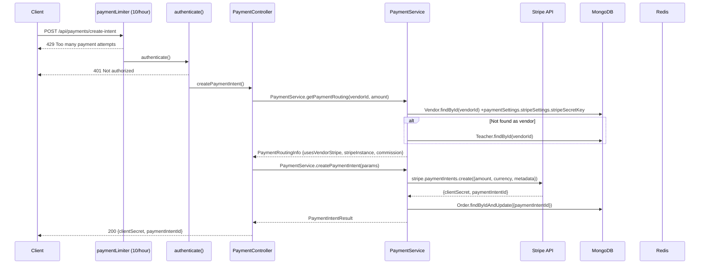
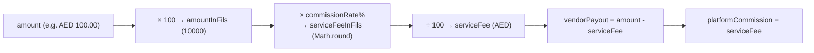
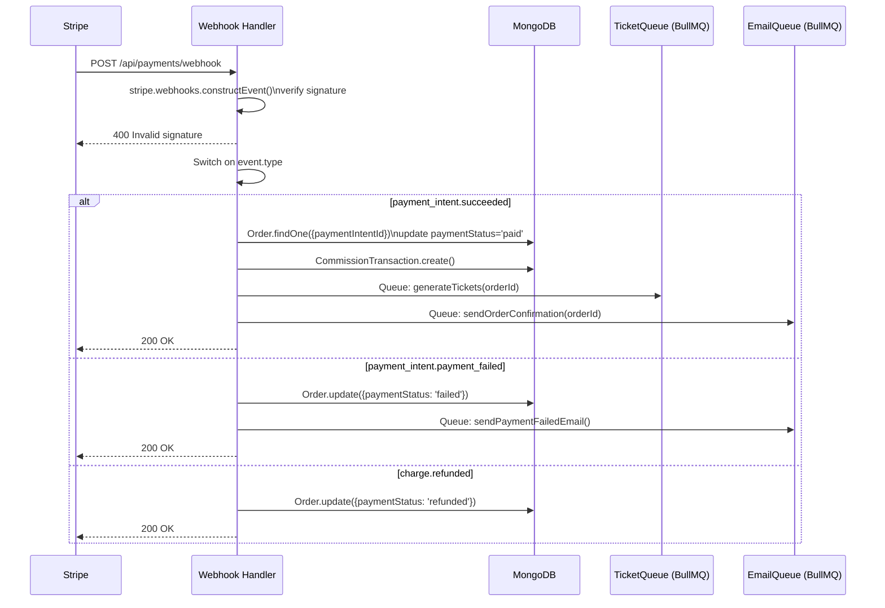
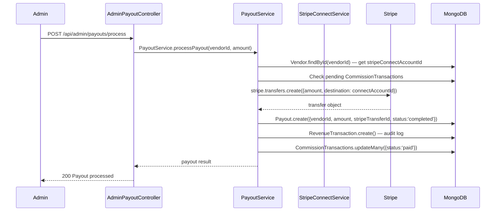
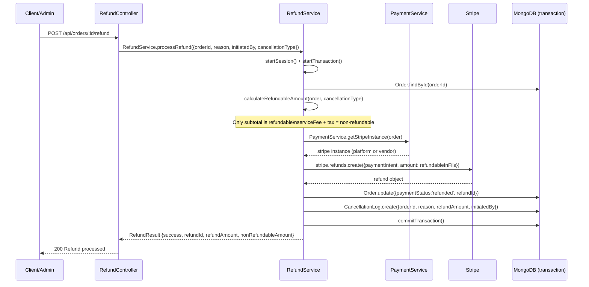

# Payment Flow

> Gema Event Management Platform
> Generated: 2026-02-25

---

## 1. Payment Routing Decision

The platform supports two payment modes for vendors/teachers:

```mermaid
flowchart TD
    A[Payment Intent Request] --> B{Fetch Vendor/Teacher}
    B -->|Not found| C[Error: Vendor or Teacher not found]
    B -->|Found| D{paymentMode == CUSTOM_STRIPE?}
    D -->|No| E[Platform Stripe + Commission]
    D -->|Yes| F{isSubscriptionActive?}
    F -->|No| E
    F -->|Yes| G{Has Stripe Connect OR Secret Key?}
    G -->|No| E
    G -->|Yes| H{Has Stripe Connect Account?}
    H -->|Yes| I[Use Platform Stripe\n→ Stripe Connect Transfer\ncommission = 0]
    H -->|No| J[Use Vendor Secret Key\n→ Vendor's Stripe account\ncommission = 0]
    E --> K[getEffectiveCommissionRate()]
    K --> L[Calculate in fils - integer math\nserviceFee = amount × rate / 100\nvendorPayout = amount - serviceFee]
```

---

## 2. Create Payment Intent Flow



---

## 3. Commission Calculation



**Integer math in fils** (smallest AED unit) prevents floating-point rounding errors.

| Scenario | Commission | Notes |
|----------|-----------|-------|
| Platform Stripe (default) | `getEffectiveCommissionRate()` | From `CommissionConfig` model |
| Custom Stripe (subscribed) | 0% | Vendor pays subscription instead |

---

## 4. Stripe Webhook Flow



---

## 5. Vendor Payout Flow



---

## 6. Refund Flow



**Refund policy:**
- Refundable: `order.subtotal - couponDiscount`
- Non-refundable: `serviceFee + tax`
- `order.paymentStatus !== 'paid'` → `refundAmount: 0`

---

## 7. Multi-Currency Support

```mermaid
flowchart LR
    A[displayAmount in displayCurrency] --> B[CurrencyService.convert()]
    B --> C[amount in base currency AED]
    C --> D[convertToStripeAmount() → fils/cents integer]
    D --> E[stripe.paymentIntents.create amount]
```

`CreatePaymentIntentParams` includes `displayCurrency` and `displayAmount` for UI display while Stripe receives the converted base currency amount.

---

## 8. Key Models

| Model | Purpose |
|-------|---------|
| `Order` | Core order record — paymentStatus, paymentIntentId, subtotal, serviceFee, tax |
| `Payment` | Stripe payment record — paymentIntentId, chargeId, status |
| `CommissionTransaction` | Platform commission per order — linked to Order, Vendor, CommissionConfig |
| `RevenueTransaction` | Full audit log of all money movement |
| `Payout` | Vendor payout records — stripeTransferId, amount, status |
| `CommissionConfig` | Per-vendor commission rates (overrides global default) |
