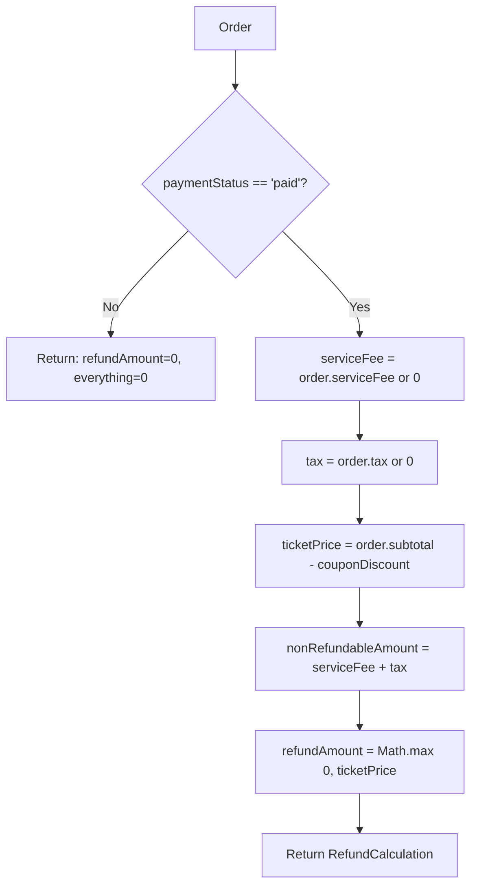
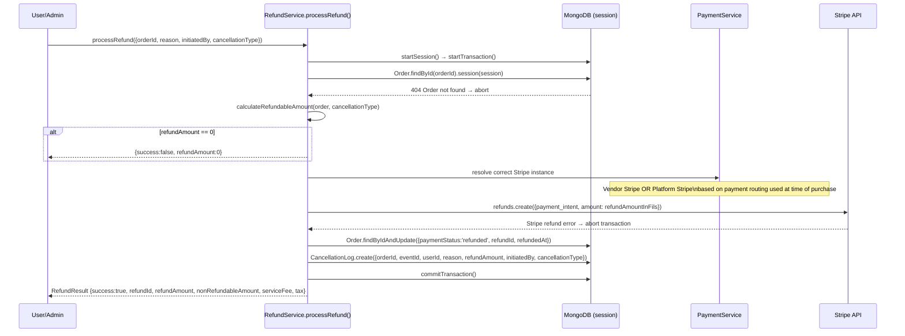
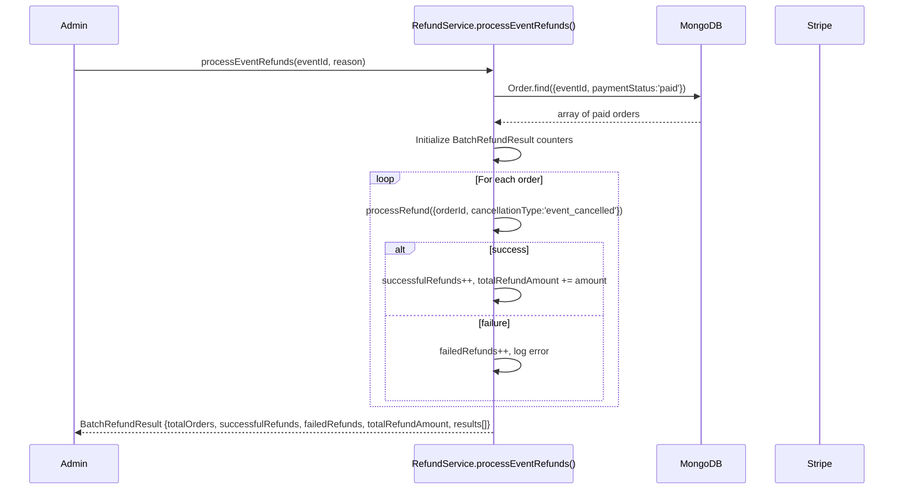

# Refund Flow

> Gema Event Management Platform
> Generated: 2026-02-25

---

## 1. Refund Policy

| Component | Refundable? | Notes |
|-----------|-------------|-------|
| Ticket price (subtotal − coupon) | Yes | Full amount refunded |
| Service fee | No | Platform revenue, non-refundable |
| Tax | No | Non-refundable |
| Coupon discount | N/A | Already deducted from subtotal |

**Condition:** `order.paymentStatus === 'paid'` required. Any other status returns `refundAmount: 0`.

---

## 2. Refund Amount Calculation



---

## 3. Single Order Refund



---

## 4. Batch Refund (Event Cancellation)



---

## 5. Cancellation Types

| Type | Triggered By | Notes |
|------|-------------|-------|
| `user_requested` | Customer via UI | Standard refund request |
| `event_cancelled` | Admin cancels event | Batch refund all paid orders |
| `admin_cancelled` | Admin cancels specific order | Manual override |

---

## 6. Error States

| Error Condition | Behavior |
|----------------|---------|
| Order not found | Transaction aborted, 404 returned |
| Order not paid | Returns `{success:true, refundAmount:0}` (no Stripe call) |
| Stripe refund fails | Transaction aborted, error propagated |
| Session commit fails | Full rollback — order + CancellationLog both reverted |

---

## 7. Data Written on Refund

**Order update:**
```
paymentStatus: 'refunded'
refundId: stripe_refund_id
refundedAt: Date
```

**CancellationLog created:**
```
orderId, eventId, userId
reason (string)
cancellationType: 'user_requested' | 'event_cancelled' | 'admin_cancelled'
initiatedBy (User ObjectId)
refundAmount (number)
```

---

## 8. Stripe Refund Details

- Amount sent to Stripe in **fils** (integer): `Math.round(refundAmount * 100)`
- Stripe `refunds.create` called on the original `paymentIntentId`
- Uses the **same Stripe instance** (platform or vendor) that processed the original payment
- Refund ID stored in Order for reconciliation
