# Ticket Generation and Check-In Flow

**Gema Event Management Platform**
Generated: 2026-02-25

---

## Table of Contents

1. [Sequence Diagram: Full Ticket Lifecycle](#1-sequence-diagram-full-ticket-lifecycle)
2. [Flowchart: Check-In Validation Flow](#2-flowchart-check-in-validation-flow)
3. [Step-by-Step Description](#3-step-by-step-description)
4. [Edge Cases](#4-edge-cases)
5. [Key Data Models](#5-key-data-models)

---

## 1. Sequence Diagram: Full Ticket Lifecycle

The following diagram covers the complete lifecycle from order confirmation through ticket generation, QR code creation, email delivery, and final check-in at the venue.

```mermaid
sequenceDiagram
    autonumber

    actor Customer
    actor Staff as Staff (Employee/Vendor/Admin)
    participant API as Express API
    participant TicketSvc as TicketGenerationService
    participant QRUtil as qrcode util
    participant DB as MongoDB
    participant Email as EmailService (BullMQ)

    %% ── Phase 1: Order Confirmed ──────────────────────────────────────
    rect rgb(230, 245, 255)
        Note over Customer,DB: Phase 1 — Order Confirmation
        Customer->>API: POST /orders (payment successful)
        API->>DB: order.status = "confirmed"
        DB-->>API: Order saved
        API->>TicketSvc: generateTicketsForOrder(orderId)
    end

    %% ── Phase 2: Ticket Generation ────────────────────────────────────
    rect rgb(230, 255, 235)
        Note over TicketSvc,DB: Phase 2 — Ticket Generation
        TicketSvc->>DB: Order.findById(orderId).populate("items.eventId")
        DB-->>TicketSvc: Order document (status must = "confirmed")
        TicketSvc->>DB: Ticket.find({ orderId }) [skipExisting check]
        alt Tickets already exist
            DB-->>TicketSvc: Existing tickets
            TicketSvc-->>API: { success: true, totalGenerated: 0 }
        else No tickets yet
            DB-->>TicketSvc: []
            TicketSvc->>DB: User.findById(order.userId)
            DB-->>TicketSvc: User document

            loop For each order item × quantity
                TicketSvc->>DB: Event.findById(orderItem.eventId)
                DB-->>TicketSvc: Event document
                TicketSvc->>TicketSvc: generateUniqueTicketNumber() → UUID (loop until unique)
                TicketSvc->>DB: Ticket.findOne({ ticketNumber }) [uniqueness check]
                DB-->>TicketSvc: null (unique confirmed)

                TicketSvc->>QRUtil: generateSecureQRData({ ticketNumber, eventId, userId, vendorId, validUntil })
                Note right of QRUtil: Produces compact URL:<br/>https://[host]/verify-ticket/[ticketNumber]
                QRUtil-->>TicketSvc: qrCodeData (URL string)

                TicketSvc->>QRUtil: generateQRCode(qrCodeData, { errorCorrectionLevel: "medium", width: 300 })
                QRUtil-->>TicketSvc: qrCodeImage (base64 data URI)

                TicketSvc->>DB: Ticket.create({ ticketNumber, qrCode, qrCodeImage, status:"active", ... })
                DB-->>TicketSvc: Saved Ticket document

                TicketSvc--)Email: sendTicketByEmail(user, event, ticketNumber, qrCodeImage) [async, non-blocking]
                Email--)Customer: Email with QR code image attached
            end

            TicketSvc-->>API: { success: true, tickets[], totalGenerated: N }
        end
    end

    %% ── Phase 3: Customer Ticket Access ───────────────────────────────
    rect rgb(255, 248, 220)
        Note over Customer,DB: Phase 3 — Ticket Access (Customer Portal)
        Customer->>API: GET /tickets/user/my-tickets [role: user|customer]
        API->>DB: Ticket.find({ userId }).populate("eventId")
        DB-->>API: Ticket list
        API-->>Customer: Ticket details + qrCodeImage

        Customer->>API: GET /tickets/:ticketId/download [role: user|customer]
        API->>DB: Ticket.findById(ticketId)
        DB-->>API: Ticket with event data
        API-->>Customer: Ticket data (PDF generation payload)
    end

    %% ── Phase 4: QR Verification at Venue ────────────────────────────
    rect rgb(255, 235, 230)
        Note over Staff,DB: Phase 4 — QR Verification (Pre Check-In)
        Staff->>API: POST /tickets/verify-qr/:eventId [role: employee|vendor|admin]
        Note right of Staff: Body: { qrCodeData }
        API->>QRUtil: validateQRData(qrCodeData)
        alt URL format
            QRUtil-->>API: { isValid: true, data: { ticketNumber } }
        else Legacy JSON format
            QRUtil->>QRUtil: Parse JSON, verify checksum, check expiresAt
            QRUtil-->>API: { isValid: true|false, data }
        end

        alt QR is structurally invalid
            API-->>Staff: 400 { status: "invalid" }
        else QR is valid
            API->>DB: Ticket.findOne({ ticketNumber }).populate(userId, eventId, vendorId)
            DB-->>API: Ticket document

            API->>DB: Employee.findOne({ userId }) [if role = employee]
            DB-->>API: Employee (vendorId check)

            API->>API: Run validation chain (see flowchart below)

            alt All checks pass
                API->>DB: Ticket update: lastValidatedBy, lastValidatedAt, scanCount +1
                API-->>Staff: 200 { status: "verified", ticket{}, event{}, vendor{}, validation{} }
            else Any check fails
                API-->>Staff: 400/403/404 with specific status code
            end
        end
    end

    %% ── Phase 5: Check-In ─────────────────────────────────────────────
    rect rgb(240, 230, 255)
        Note over Staff,DB: Phase 5 — Check-In (Two Paths)

        alt Path A: via /checkin route (Employee only)
            Staff->>API: POST /checkin [role: employee]
            Note right of Staff: Body: { ticketNumber, employeeId, location, deviceInfo, geoLocation }
            API->>DB: Ticket.findOne({ ticketNumber })
            API->>DB: Employee.findById(employeeId)
            API->>API: Check employee.assignedEvents includes ticket.eventId
            API->>DB: ticket.status = "used", checkInDetails updated
            DB-->>API: Saved ticket
            API->>DB: CheckinLog.create({ scanResult: "success", ... })
            DB-->>API: CheckinLog document
            API-->>Staff: 200 { ticket, checkinLog }

        else Path B: via /tickets/:ticketId/checkin (Employee/Vendor/Admin)
            Staff->>API: POST /tickets/:ticketId/checkin [role: employee|vendor|admin]
            Note right of Staff: Body: { notes, location }
            API->>DB: Ticket.findById(ticketId).populate(userId, eventId)
            API->>API: Validate: status == "active", not expired, not already checked in
            API->>DB: ticket.status = "used", checkInDetails updated
            DB-->>API: Saved ticket
            API-->>Staff: 200 { status: "checked_in", ticket summary }
        end
    end

    %% ── Phase 6: Reporting ────────────────────────────────────────────
    rect rgb(240, 240, 240)
        Note over Staff,DB: Phase 6 — Reporting
        Staff->>API: GET /checkin/summary?eventId=X [role: vendor|admin]
        API->>DB: Ticket.countDocuments (total + checked-in)
        API->>DB: CheckinLog.distinct("customerId", { scanResult:"success" })
        DB-->>API: Aggregated counts
        API-->>Staff: { totalTickets, checkedInTickets, uncheckedTickets, uniqueAttendees, checkInRate% }

        Staff->>API: GET /checkin/logs?eventId=X [role: vendor|admin|employee]
        API->>DB: CheckinLog.find(filter).populate(...)
        DB-->>API: Log entries
        API-->>Staff: Detailed scan log list
    end
```



---

## 2. Flowchart: Check-In Validation Flow

This diagram details every conditional branch evaluated during the QR verification and check-in process.

```mermaid
flowchart TD
    A([Staff scans QR code]) --> B[POST /tickets/verify-qr/:eventId\nor POST /checkin]

    B --> C{Authenticated?}
    C -- No --> CERR[401 Unauthorized]
    C -- Yes --> D{Role: employee\nvendor or admin?}
    D -- No --> DERR[403 Forbidden]
    D -- Yes --> E[Parse & validate\nQR code string]

    E --> F{QR format?}
    F -- URL format --> G[Extract ticketNumber\nfrom URL path]
    F -- Legacy JSON --> H[Parse JSON,\nverify checksum,\ncheck expiresAt field]
    F -- Unknown --> FQERR[400 Invalid QR code format]

    H --> I{Checksum valid\n& not expired?}
    I -- No --> IQERR[400 QR integrity failed\nor QR expired]
    I -- Yes --> G

    G --> J[Ticket.findOne\nticketNumber]
    J --> K{Ticket found?}
    K -- No --> KERR[404 Ticket not found]
    K -- Yes --> L{Role = employee?}

    L -- Yes --> M[Employee.findOne\nuserId]
    M --> N{Employee found?}
    N -- No --> NERR[404 Employee not found]
    N -- Yes --> O{ticket.vendorId ==\nemployee.vendorId?}
    O -- No --> OERR[403 Ticket belongs\nto different vendor]
    O -- Yes --> P

    L -- No\nvendor or admin --> P

    P --> Q{eventId param\nprovided?}
    Q -- Yes --> R{ticket.eventId ==\nrequested eventId?}
    R -- No --> RERR[400 Wrong event]
    R -- Yes --> S
    Q -- No --> S

    S --> T{ticket.isExpired?\nvalidUntil < now}
    T -- Yes --> TERR[400 Ticket expired]
    T -- No --> U{ticket.status?}

    U -- used --> UERR[400 Already used\nshows checkInTime]
    U -- cancelled --> UERR2[400 Ticket cancelled]
    U -- refunded --> UERR3[400 Ticket refunded]
    U -- transferred --> UERR4[400 Ticket transferred]
    U -- active --> V

    V --> W{validFrom set\n& now < validFrom?}
    W -- Yes --> WERR[400 Not yet valid\nshows validFrom]
    W -- No --> X

    X --> Y{Event end date +\n24h < now?}
    Y -- Yes --> YERR[400 Event has ended]
    Y -- No --> Z

    Z --> AA[Update Ticket:\nlastValidatedBy, lastValidatedAt\nscanCount +1]
    AA --> AB[Return 200 verified\nticket + event + vendor + validation info]

    AB --> AC{Proceed to\ncheck-in?}
    AC -- Yes --> AD[POST /tickets/:id/checkin\nor POST /checkin]
    AC -- No --> END1([Verification only complete])

    AD --> AE{ticket.status == active\n& not expired\n& not isCheckedIn?}
    AE -- No --> AEERR[400 Cannot check-in\ngiven status]
    AE -- Yes --> AF[Set ticket.status = used\ncheckInDetails.isCheckedIn = true\ncheckInDetails.checkInTime = now\ncheckInDetails.checkInBy = staffId\nscanCount +1]

    AF --> AG[ticket.save]
    AG --> AH{Via /checkin\nroute?}
    AH -- Yes --> AI[CheckinLog.create\nscanResult: success\ndeviceInfo, geoLocation, notes]
    AH -- No --> AJ

    AI --> AJ[200 checked_in response]
    AJ --> END2([Check-in complete])

    style CERR fill:#ff6b6b,color:#fff
    style DERR fill:#ff6b6b,color:#fff
    style FQERR fill:#ff6b6b,color:#fff
    style IQERR fill:#ff6b6b,color:#fff
    style KERR fill:#ff6b6b,color:#fff
    style NERR fill:#ff6b6b,color:#fff
    style OERR fill:#ff6b6b,color:#fff
    style RERR fill:#ff6b6b,color:#fff
    style TERR fill:#ff8c42,color:#fff
    style UERR fill:#ff8c42,color:#fff
    style UERR2 fill:#ff8c42,color:#fff
    style UERR3 fill:#ff8c42,color:#fff
    style UERR4 fill:#ff8c42,color:#fff
    style WERR fill:#ff8c42,color:#fff
    style YERR fill:#ff8c42,color:#fff
    style AEERR fill:#ff8c42,color:#fff
    style AB fill:#51cf66,color:#fff
    style AJ fill:#51cf66,color:#fff
    style END1 fill:#339af0,color:#fff
    style END2 fill:#339af0,color:#fff
```



---

## 3. Step-by-Step Description

### Phase 1: Order Confirmation Trigger

Ticket generation is always triggered by a confirmed order. An order must have `status = "confirmed"` before any ticket is created. Confirmation occurs after successful payment processing via Stripe. The generation can be triggered in two ways:

- **Automatic**: The payment/order service calls `TicketGenerationService.generateTicketsForOrder(orderId)` immediately after order confirmation.
- **Manual recovery**: A user or admin calls `POST /tickets/generate-missing` to regenerate tickets for orders that somehow completed payment without tickets being issued (e.g., due to a transient error).

### Phase 2: Per-Item Ticket Generation

`TicketGenerationService.generateTicketsForOrder` orchestrates the full generation loop:

1. The order is fetched with `items.eventId` populated.
2. A guard checks for existing tickets (`Ticket.find({ orderId })`). If found and `skipExisting = true`, generation is skipped and existing tickets are returned. This prevents duplicate tickets across retries.
3. The associated `User` document is fetched for attendee metadata (name, email, phone).
4. For each `orderItem` in the order (an order may include tickets for multiple events), and for each unit of `orderItem.quantity`, the following steps run:
   - A UUID v4 is generated and verified unique against the `Ticket` collection in a spin loop.
   - `generateSecureQRData` produces a compact verification URL: `https://[FRONTEND_URL]/verify-ticket/[ticketNumber]`. This URL format keeps the QR code small and scannable (approximately 100 characters vs. the legacy JSON format at 2,700+ characters).
   - `generateQRCode` renders the URL into a 300px-wide base64 PNG data URI using medium error correction level.
   - The `Ticket` document is persisted with `status = "active"`, full attendee info, `validFrom = scheduleDate`, and `validUntil = scheduleDate + 24 hours`.
5. Email delivery is fired asynchronously (`.then().catch()`) via `sendTicketByEmail`. Email failure is logged as a warning but does not fail ticket generation.

### Phase 3: Customer Ticket Access

Once generated, customers can access their tickets through:

- `GET /tickets/user/my-tickets` — returns all tickets owned by the authenticated user, optionally filtered by `status` or `upcoming=true`.
- `GET /tickets/order/:orderId` — returns all tickets for a specific order, verifying the requesting user owns at least one ticket in that order.
- `GET /tickets/:ticketId/download` — returns ticket data formatted for PDF rendering on the frontend.
- `POST /tickets/:ticketId/resend` — re-sends the ticket email to the attendee's email address.

### Phase 4: QR Code Verification

Before check-in, staff scan the attendee's QR code using `POST /tickets/verify-qr/:eventId`. This is a read-mostly validation step that does **not** mark the ticket as used.

The `validateQRData` utility handles two QR formats:

- **URL format** (current default): extracts `ticketNumber` from the path `/verify-ticket/:ticketNumber`.
- **Legacy JSON format**: parses the JSON payload, verifies an 8-character base64 checksum derived from `ticketNumber + eventId + generatedAt`, and checks `expiresAt`.

After structural validation, the controller runs a sequential chain of business checks (detailed in the flowchart):

1. Ticket existence in the database
2. Vendor-scoping for employees (an employee may only scan tickets belonging to their vendor)
3. Event ID match (if an `eventId` URL param is provided)
4. Ticket expiry (`validUntil < now`)
5. Ticket status (`used`, `cancelled`, `refunded`, `transferred` all reject)
6. Temporal validity (`validFrom` not yet reached)
7. Event end date (ticket is invalid more than 24 hours after the last scheduled event date)

On success, `metadata.lastValidatedBy`, `metadata.lastValidatedAt`, and `checkInDetails.scanCount` are incremented, and the full ticket, event, vendor, and validation context is returned to the scanning device.

### Phase 5: Check-In Execution

There are two distinct check-in routes that serve different operational contexts:

**Path A — `POST /checkin` (dedicated check-in controller, employees only)**

This route is optimized for gate staff. It accepts `ticketNumber` (not ticket ID) directly from the scan, along with rich context: `employeeId`, `location`, `deviceInfo` (device ID, name, app version, OS version), and `geoLocation` (latitude, longitude, accuracy).

After marking the ticket as `used`, it creates a `CheckinLog` document capturing the full scan audit record including the `scanResult` outcome.

**Path B — `POST /tickets/:ticketId/checkin` (ticket controller, employee/vendor/admin)**

This route is used when the staff already has a ticket ID (e.g., from the verification response). It accepts `notes` and `location`. It does not create a `CheckinLog` entry, making it more lightweight but with less audit fidelity. Both paths perform the same terminal state transition: `ticket.status = "used"` and `checkInDetails.isCheckedIn = true`.

### Phase 6: Reporting and Audit

Vendors and admins can monitor check-in progress in real time:

- `GET /checkin/summary?eventId=X` returns `totalTickets`, `checkedInTickets`, `uncheckedTickets`, `uniqueAttendees` (distinct customer IDs with successful scans), and `checkInRate` as a percentage.
- `GET /checkin/logs?eventId=X` returns the full `CheckinLog` collection for an event, filterable by `employeeId` and `scanResult`. Each log entry is populated with ticket number, event name, employee name, and customer name.

---

## 4. Edge Cases

### 4.1 Duplicate Scan (Already Checked In)

**Trigger**: Staff scans a QR code for a ticket that has already been processed.

**Detection points**:
- `verifyTicketQR`: checks `ticket.status === "used"` and returns HTTP 400 with `status: "already_used"`, along with `checkInDetails.checkInTime` and `checkInDetails.checkInBy` so staff know when and by whom it was first used.
- `checkInTicket` (ticket controller): checks `ticket.checkInDetails?.isCheckedIn === true` and returns HTTP 400.
- `checkInTicket` (checkin controller): checks `ticket.status === "used"` and returns HTTP 409 Conflict.

**Scan count behavior**: `checkInDetails.scanCount` is incremented on every `verifyTicketQR` call regardless of the result, providing a full audit trail of scan attempts. This means a ticket can have `scanCount > 1` while remaining `status: "active"` if it was verified multiple times before the final check-in commit.

**No `CheckinLog` entry** is created for duplicate scan attempts through Path B. Path A (checkin controller) short-circuits before `CheckinLog.create` for `used`/`cancelled`/`refunded` statuses.

### 4.2 Invalid QR Code

**Trigger**: A corrupted, forged, or manually entered QR string is submitted.

**Detection**:
- `validateQRData` returns `{ isValid: false }` for strings that are neither a valid URL containing `/verify-ticket/`, nor parseable JSON.
- For legacy JSON, checksum mismatch (`data.checksum !== expectedChecksum`) returns `{ isValid: false, error: "QR code integrity check failed" }`.
- For legacy JSON, an `expiresAt` field in the past returns `{ isValid: false, error: "QR code has expired" }`.

**Response**: HTTP 400 with `status: "invalid"` and the specific error message from the validator. No database writes occur.

**Note on URL format security**: The current production QR format is a plain URL (`/verify-ticket/:ticketNumber`). There is no HMAC or cryptographic signature in the URL itself; integrity relies entirely on the database lookup — only a ticketNumber that exists in the `Ticket` collection will pass. This is by design to keep QR codes small and scannable.

### 4.3 Cross-Vendor Ticket Scan

**Trigger**: An employee attempts to scan a ticket that belongs to a different vendor's event.

**Detection**: When `req.user.role === "employee"`, the controller fetches the `Employee` document by `userId` and compares `employee.vendorId` to `ticket.vendorId`.

**Response**: HTTP 403 with `status: "invalid_vendor"`, logging the ticket's vendor and the employee's vendor for audit purposes. This prevents staff from one venue inadvertently (or maliciously) checking in attendees for a different vendor's event.

### 4.4 Ticket Not Yet Valid

**Trigger**: Staff scans a valid ticket before the event date (`now < ticket.validFrom`).

**Detection**: `verifyTicketQR` checks `ticket.validFrom && now < ticket.validFrom`.

**Response**: HTTP 400 with `status: "not_yet_valid"` and the `validFrom` timestamp displayed so the attendee knows when it becomes valid.

### 4.5 Expired Ticket

**Trigger**: A ticket is scanned more than 24 hours after its scheduled event date.

**Detection (two layers)**:
1. **Schema pre-save hook**: `TicketSchema.pre("save")` automatically transitions `status` from `"active"` to `"expired"` if `validUntil < now` at save time.
2. **Virtual `isExpired`**: computed as `this.validUntil ? new Date() > this.validUntil : false`. Both `verifyTicketQR` and `checkInTicket` check `ticket.isExpired` before accepting the ticket.
3. **Event end date check**: `verifyTicketQR` additionally checks if `now > lastEventDate + 24h` as a belt-and-suspenders guard even if the schema hook has not run yet.

**Response**: HTTP 400 with `status: "expired"` and the expiry timestamp.

### 4.6 Ticket Generation for Non-Confirmed Order

**Trigger**: `generateTicketsForOrder` is called for an order with `status !== "confirmed"` (e.g., `"pending"` or `"failed"`).

**Detection**: The service explicitly checks `order.status !== "confirmed"` and throws `Error("Order must be confirmed to generate tickets")`.

**Response**: The service returns `{ success: false, errors: [...], totalGenerated: 0 }`. The HTTP controller translates this into a 400 or 500 response depending on the call path.

### 4.7 Partial Ticket Generation Failure

**Trigger**: One event in a multi-event order cannot be found, or a per-ticket creation fails (e.g., database constraint violation).

**Behavior**: `TicketGenerationService` wraps each `orderItem` loop and each per-quantity iteration in independent try/catch blocks. Failures are collected in the `errors[]` array but do not abort generation for the remaining items. The service returns `success: true` as long as at least one ticket was generated (`tickets.length > 0 || errors.length === 0`). Partial success is logged and the error messages are returned to the caller for inspection.

### 4.8 Ticket Transfer Before Check-In

**Trigger**: A customer transfers a ticket to another user via `POST /tickets/:ticketId/transfer`.

**Eligibility check** (virtual `canBeTransferred`):
```
status === "active" && !checkInDetails.isCheckedIn && !isExpired
```

**Behavior**: The ticket's `userId` and `attendeeEmail`/`attendeeName` are updated to the recipient. A `transferHistory` entry is appended. The QR code is regenerated for the new owner. The ticket `status` remains `"active"` after transfer (the controller resets it to `"active"` explicitly). The recipient receives a ticket email with the new QR code.

**Implication for check-in**: If a transferred ticket is scanned, the QR code will route to the new owner's ticket record. The `vendorId` on the ticket remains unchanged, so employee vendor-scoping still applies correctly.

### 4.9 Missing Tickets Recovery

**Trigger**: A user finds their confirmed order has no tickets (e.g., due to a transient error during the initial generation).

**Path**: `POST /tickets/generate-missing` (accessible to all authenticated users for their own orders, and to admin/vendor for any order).

**Behavior**: Calls `TicketGenerationService.generateMissingTicketsForOrder`, which sets `skipExisting: true` and `sendEmail: false`. If tickets already exist, it returns them without creating duplicates. Email is suppressed to avoid re-sending to customers who already received their ticket email but whose tickets were generated in a background retry.

---

## 5. Key Data Models

### 5.1 Ticket

**Collection**: `tickets`
**File**: `backend/src/models/Ticket.ts`

| Field | Type | Description |
|---|---|---|
| `ticketNumber` | `String` (unique) | UUID v4, the primary human-readable identifier embedded in the QR code URL |
| `orderId` | `ObjectId -> Order` | Parent order that generated this ticket |
| `userId` | `ObjectId -> User` | Current ticket owner (changes on transfer) |
| `eventId` | `ObjectId -> Event` | The event this ticket admits entry to |
| `vendorId` | `ObjectId -> Vendor` | Vendor who owns the event; used for employee scoping |
| `qrCode` | `String` | The raw QR payload (URL format: `https://[host]/verify-ticket/[ticketNumber]`) |
| `qrCodeImage` | `String` | Base64 PNG data URI of the rendered QR code (stored in DB for email/download) |
| `ticketType` | `String` | e.g., `"general"`, `"vip"` |
| `seatNumber` | `String?` | Optional seat assignment |
| `seatsAllocated` | `Number` | Quantity from the order item |
| `attendeeName` | `String` | Name at time of generation (may differ from user name after transfer) |
| `attendeeEmail` | `String` | Email at time of generation (updated on transfer) |
| `attendeePhone` | `String?` | Optional phone |
| `price` | `Number` | Unit price from the order item |
| `currency` | `String` | e.g., `"AED"` |
| `status` | `Enum` | `active`, `used`, `cancelled`, `refunded`, `expired`, `transferred` |
| `checkInDetails.isCheckedIn` | `Boolean` | True after successful check-in |
| `checkInDetails.checkInTime` | `Date?` | Timestamp of check-in |
| `checkInDetails.checkInBy` | `ObjectId -> Employee?` | Staff who performed check-in |
| `checkInDetails.checkInLocation` | `String?` | Gate or location label |
| `checkInDetails.scanCount` | `Number` | Total number of times QR was scanned (including verification-only scans) |
| `validFrom` | `Date?` | Earliest time the ticket is valid (set to event `scheduleDate`) |
| `validUntil` | `Date?` | Latest time the ticket is valid (set to `scheduleDate + 24h`) |
| `transferHistory` | `Array` | Append-only log of ownership transfers |
| `metadata.generatedBy` | `ObjectId?` | User who triggered generation |
| `metadata.lastValidatedBy` | `ObjectId?` | Staff who last ran `verifyTicketQR` |
| `metadata.lastValidatedAt` | `Date?` | Timestamp of last QR verification |

**Virtual properties**:
- `isExpired`: `boolean` — `validUntil < now`
- `isValid`: `boolean` — `now >= validFrom && now <= validUntil && status === "active"`
- `canBeTransferred`: `boolean` — `status === "active" && !isCheckedIn && !isExpired`

**Key indexes**: `ticketNumber` (unique), `{ userId, status }`, `{ eventId, status }`, `{ vendorId, status }`, `{ validFrom, validUntil }`, `{ status, validUntil }`

**Pre-save hook**: Automatically transitions `status` to `"expired"` when `validUntil < now` and `status === "active"`.

---

### 5.2 CheckinLog

**Collection**: `checkinlogs`
**File**: `backend/src/models/CheckinLog.ts`

| Field | Type | Description |
|---|---|---|
| `ticketId` | `ObjectId -> Ticket` | The ticket that was scanned |
| `eventId` | `ObjectId -> Event` | Event context for the scan |
| `employeeId` | `ObjectId -> Employee` | Staff member who performed the scan |
| `customerId` | `ObjectId -> User` | Ticket owner at time of scan |
| `scanResult` | `Enum` | `success`, `invalid`, `duplicate`, `expired`, `unauthorized` |
| `scanTime` | `Date` | Exact timestamp of the scan attempt |
| `location` | `String?` | Gate or location label (e.g., `"Gate A"`) |
| `deviceInfo.deviceId` | `String?` | Unique identifier of the scanning device |
| `deviceInfo.deviceName` | `String?` | Human-readable device name |
| `deviceInfo.appVersion` | `String?` | Version of the scanning app |
| `deviceInfo.osVersion` | `String?` | Operating system version of the scanning device |
| `geoLocation.latitude` | `Number?` | GPS latitude at scan time |
| `geoLocation.longitude` | `Number?` | GPS longitude at scan time |
| `geoLocation.accuracy` | `Number?` | GPS accuracy in meters |
| `notes` | `String?` | Free-text notes from the staff member |

**Note**: `CheckinLog` entries are only created via the dedicated `/checkin` route (Path A). The `/tickets/:ticketId/checkin` route (Path B) updates the ticket directly without creating a log entry, providing less audit detail.

---

### 5.3 QR Code Formats

Two formats are supported for backward compatibility:

**Current (URL format)**
```
https://gema-project.onrender.com/verify-ticket/550e8400-e29b-41d4-a716-446655440000
```
- Approximately 80-100 characters
- No embedded signature; authenticity relies on DB lookup
- Scans as a clickable URL on any smartphone camera app

**Legacy (JSON format)** — retained for backward compatibility
```json
{
  "ticketNumber": "550e8400-e29b-41d4-a716-446655440000",
  "eventId": "64a1b2c3d4e5f6...",
  "userId": "64a1b2c3d4e5f7...",
  "vendorId": "64a1b2c3d4e5f8...",
  "generatedAt": "2026-02-25T10:00:00.000Z",
  "expiresAt": "2026-02-26T10:00:00.000Z",
  "version": "1.0",
  "checksum": "abc12345"
}
```
- Approximately 2,700+ characters
- Includes an 8-character base64 checksum for integrity validation
- The `validateQRData` utility handles both formats transparently

---

### 5.4 Ticket Status State Machine

```
                    ┌─────────┐
                    │  active │ ← initial state on creation
                    └────┬────┘
          ┌──────────────┼──────────────┬────────────────┐
          ▼              ▼              ▼                ▼
       ┌──────┐    ┌───────────┐  ┌───────────┐  ┌─────────────┐
       │ used │    │ cancelled │  │  expired  │  │ transferred │
       └──────┘    └───────────┘  └───────────┘  └─────────────┘
                                                       │
                                                       │ (new owner
                                                       │  ticket becomes
                                                       │  active again)
                                                       ▼
                                                  ┌─────────┐
                                                  │  active │
                                                  └─────────┘

  refunded: set externally by payment/order service
```

Valid transitions:
- `active` → `used`: check-in performed (via either check-in path)
- `active` → `cancelled`: `ticket.cancel()` called; only if not yet checked in
- `active` → `expired`: pre-save hook fires when `validUntil < now`
- `active` → `transferred`: `ticket.transfer()` called; `canBeTransferred` must be true
- `active`/`used` → `refunded`: set by the payment/order cancellation flow (external to ticket routes)
