# Entity Relationship Diagram

> Generated from **48** Mongoose models
> Mode: with fields
> Generated: 2026-02-25

```mermaid
erDiagram
    AdminRevenueSettings {
        string id
    }
    AdvertisingCampaign {
        string id
    }
    Affiliate {
        string id
    }
    AffiliateEventClick {
        string id
    }
    AffiliateVenueClick {
        string id
    }
    AnnouncementBar {
        string id
    }
    Banner {
        string id
    }
    Blog {
        string id
    }
    BlogCategory {
        string id
    }
    Booking {
        string id
    }
    CancellationLog {
        string id
    }
    Category {
        string id
    }
    CheckinLog {
        string id
    }
    Collection {
        string id
    }
    Comment {
        string id
    }
    CommissionConfig {
        string id
    }
    CommissionTransaction {
        string id
    }
    Contact {
        string id
    }
    Coupon {
        string id
    }
    EmailSettings {
        string id
    }
    Employee {
        string id
    }
    Event {
        string id
    }
    EventAddon {
        string id
    }
    MediaAsset {
        string id
    }
    NewsletterSubscriber {
        string id
    }
    Notification {
        string id
    }
    Order {
        string id
    }
    Partnership {
        string id
    }
    Payment {
        string id
    }
    PaymentSettings {
        string id
    }
    Payout {
        string id
    }
    PopupNotification {
        string id
    }
    Reel {
        string id
    }
    RefreshToken {
        string id
    }
    Registration {
        string id
    }
    RevenueTransaction {
        string id
    }
    Review {
        string id
    }
    SEOContent {
        string id
    }
    SocialSettings {
        string id
    }
    SystemSettings {
        string id
    }
    teacher.AdvertisingCampaign {
        string id
    }
    Teacher {
        string id
    }
    TeacherBooking {
        string id
    }
    TeacherSubscription {
        string id
    }
    Ticket {
        string id
    }
    User {
        string id
    }
    Vendor {
        string id
    }
    VendorSubscription {
        string id
    }
    AdminRevenueSettings }o--|| User : "ref"
    AdvertisingCampaign }o--|| User : "ref"
    AdvertisingCampaign }o--|| Event : "ref"
    Affiliate }o--|| Order : "ref"
    Affiliate }o--|| Payout : "ref"
    Affiliate }o--|| User : "ref"
    Affiliate }o--|| Event : "ref"
    AffiliateEventClick }o--|| Event : "ref"
    AffiliateEventClick }o--|| User : "ref"
    AffiliateVenueClick }o--|| Event : "ref"
    AffiliateVenueClick }o--|| User : "ref"
    AnnouncementBar }o--|| User : "ref"
    Banner }o--|| MediaAsset : "ref"
    Banner }o--|| User : "ref"
    Blog }o--|| MediaAsset : "ref"
    Blog }o--|| BlogCategory : "ref"
    Blog }o--|| User : "ref"
    BlogCategory }o--|| Blog : "ref"
    Booking }o--|| User : "ref"
    Booking }o--|| Event : "ref"
    CancellationLog }o--|| Order : "ref"
    CancellationLog }o--|| Event : "ref"
    CancellationLog }o--|| User : "ref"
    Category }o--|| MediaAsset : "ref"
    CheckinLog }o--|| Ticket : "ref"
    CheckinLog }o--|| Event : "ref"
    CheckinLog }o--|| Employee : "ref"
    CheckinLog }o--|| User : "ref"
    Collection }o--|| MediaAsset : "ref"
    Collection }o--|| Event : "ref"
    Collection }o--|| Vendor : "ref"
    Comment }o--|| User : "ref"
    CommissionConfig }o--|| User : "ref"
    CommissionTransaction }o--|| Order : "ref"
    CommissionTransaction }o--|| Vendor : "ref"
    CommissionTransaction }o--|| User : "ref"
    CommissionTransaction }o--|| CommissionConfig : "ref"
    Coupon }o--|| User : "ref"
    Coupon }o--|| Order : "ref"
    Coupon }o--|| Event : "ref"
    Coupon }o--|| Category : "ref"
    Employee }o--|| Vendor : "ref"
    Employee }o--|| User : "ref"
    Employee }o--|| Event : "ref"
    Employee }o--|| Ticket : "ref"
    Event }o--|| Teacher : "ref"
    Event }o--|| Vendor : "ref"
    Event }o--|| MediaAsset : "ref"
    Event }o--|| User : "ref"
    Event }o--|| Employee : "ref"
    EventAddon }o--|| User : "ref"
    MediaAsset }o--|| User : "ref"
    Notification }o--|| User : "ref"
    Order }o--|| Event : "ref"
    Order }o--|| User : "ref"
    Order }o--|| RevenueTransaction : "ref"
    Payment }o--|| User : "ref"
    Payment }o--|| Order : "ref"
    Payout }o--|| Vendor : "ref"
    Payout }o--|| User : "ref"
    Payout }o--|| RevenueTransaction : "ref"
    PopupNotification }o--|| MediaAsset : "ref"
    PopupNotification }o--|| User : "ref"
    Reel }o--|| MediaAsset : "ref"
    Reel }o--|| Event : "ref"
    RefreshToken }o--|| User : "ref"
    Registration }o--|| Event : "ref"
    Registration }o--|| User : "ref"
    RevenueTransaction }o--|| Order : "ref"
    RevenueTransaction }o--|| User : "ref"
    RevenueTransaction }o--|| Teacher : "ref"
    Review }o--|| Event : "ref"
    Review }o--|| User : "ref"
    Review }o--|| Order : "ref"
    SEOContent }o--|| User : "ref"
    teacher.AdvertisingCampaign }o--|| User : "ref"
    Teacher }o--|| User : "ref"
    Teacher }o--|| MediaAsset : "ref"
    Teacher }o--|| CommissionConfig : "ref"
    Teacher }o--|| TeacherSubscription : "ref"
    Teacher }o--|| CommissionTransaction : "ref"
    TeacherBooking }o--|| User : "ref"
    TeacherBooking }o--|| RevenueTransaction : "ref"
    TeacherSubscription }o--|| Teacher : "ref"
    TeacherSubscription }o--|| User : "ref"
    Ticket }o--|| Order : "ref"
    Ticket }o--|| User : "ref"
    Ticket }o--|| Event : "ref"
    Ticket }o--|| Vendor : "ref"
    Ticket }o--|| Employee : "ref"
    User }o--|| Event : "ref"
    Vendor }o--|| User : "ref"
    VendorSubscription }o--|| User : "ref"
```

## Model Index

- `AdminRevenueSettings`
- `AdvertisingCampaign`
- `Affiliate`
- `AffiliateEventClick`
- `AffiliateVenueClick`
- `AnnouncementBar`
- `Banner`
- `Blog`
- `BlogCategory`
- `Booking`
- `CancellationLog`
- `Category`
- `CheckinLog`
- `Collection`
- `Comment`
- `CommissionConfig`
- `CommissionTransaction`
- `Contact`
- `Coupon`
- `EmailSettings`
- `Employee`
- `Event`
- `EventAddon`
- `MediaAsset`
- `NewsletterSubscriber`
- `Notification`
- `Order`
- `Partnership`
- `Payment`
- `PaymentSettings`
- `Payout`
- `PopupNotification`
- `Reel`
- `RefreshToken`
- `Registration`
- `RevenueTransaction`
- `Review`
- `SEOContent`
- `SocialSettings`
- `SystemSettings`
- `Teacher`
- `TeacherBooking`
- `TeacherSubscription`
- `Ticket`
- `User`
- `Vendor`
- `VendorSubscription`
- `teacher.AdvertisingCampaign`

## Summary: 93 relationships across 48 models