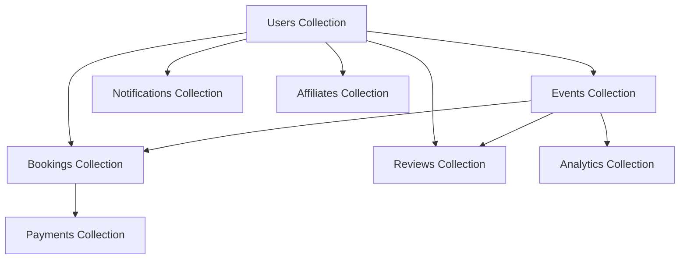

# Database Documentation

## 🗄️ MongoDB Schema & Data Modeling

This section contains comprehensive documentation for the Gema Event Management Platform's MongoDB database design, including schemas, relationships, and data modeling principles.

---

## 📑 Section Contents

### [📊 Schema Overview](./schema-overview.md)
High-level database design and architectural principles:
- Database design philosophy
- Collection organization strategy
- Indexing and performance considerations
- Data validation and constraints

### [📋 Collections Reference](./collections-reference.md)
Detailed documentation for all 25+ MongoDB collections:
- Complete field specifications
- Data types and validation rules
- Relationships and references
- Sample documents and examples

### [🔗 Data Relationships](./data-relationships.md)
Entity relationships and data flow patterns:
- Collection relationships and foreign keys
- Data normalization vs. denormalization decisions
- Query patterns and optimization
- Transaction handling and consistency

---

## 🏗️ Database Architecture Overview



---

## 📈 Key Statistics

| Metric | Count | Description |
|--------|--------|-------------|
| **Total Collections** | 25+ | Core business collections |
| **Primary Entities** | 8 | Main business objects |
| **Supporting Entities** | 17+ | Auxiliary and system collections |
| **Indexed Fields** | 50+ | Performance-optimized queries |
| **Validation Rules** | 100+ | Data integrity constraints |

---

## 🎯 Core Collections

### Primary Business Entities
- **[Users](./collections-reference.md#users)** - Authentication and user management
- **[Events](./collections-reference.md#events)** - Core business entity
- **[Bookings](./collections-reference.md#bookings)** - Order and reservation management
- **[Payments](./collections-reference.md#payments)** - Financial transactions
- **[Reviews](./collections-reference.md#reviews)** - User feedback and ratings
- **[Venues](./collections-reference.md#venues)** - Physical locations
- **[Vendors](./collections-reference.md#vendors)** - Service providers
- **[Categories](./collections-reference.md#categories)** - Content organization

### Supporting Collections
- **Notifications** - Real-time messaging
- **Analytics** - Business intelligence
- **Affiliates** - Marketing and referrals
- **Coupons** - Promotional campaigns
- **Media** - File and asset management
- **Audit Logs** - System tracking
- **Sessions** - User session management

---

## 🔍 Quick Reference

### Common Query Patterns
```javascript
// Find events by category
db.events.find({ category: "Entertainment", isApproved: true })

// Get user bookings with event details
db.bookings.aggregate([
  { $match: { userId: ObjectId("...") } },
  { $lookup: { from: "events", localField: "eventId", foreignField: "_id", as: "event" } }
])

// Find popular events by booking count
db.events.aggregate([
  { $lookup: { from: "bookings", localField: "_id", foreignField: "eventId", as: "bookings" } },
  { $addFields: { bookingCount: { $size: "$bookings" } } },
  { $sort: { bookingCount: -1 } }
])
```

### Performance Indexes
```javascript
// User authentication
db.users.createIndex({ email: 1 }, { unique: true })
db.users.createIndex({ role: 1, status: 1 })

// Event queries
db.events.createIndex({ category: 1, isApproved: 1 })
db.events.createIndex({ vendorId: 1, status: 1 })
db.events.createIndex({ "location.coordinates": "2dsphere" })

// Booking operations
db.bookings.createIndex({ userId: 1, status: 1 })
db.bookings.createIndex({ eventId: 1, createdAt: -1 })
```

---

## 🛡️ Data Security & Validation

### Field Validation
- **Email Validation**: Regex patterns for email formats
- **Password Security**: Hashed storage with bcrypt
- **ObjectId References**: Validation for inter-collection relationships
- **Enum Values**: Restricted choices for status and type fields
- **Required Fields**: Essential data integrity constraints

### Security Measures
- **Index Security**: Compound indexes for efficient queries
- **Data Sanitization**: Input cleaning and validation
- **Access Patterns**: Role-based data access
- **Audit Trails**: Comprehensive logging of data changes

---

## 📊 Performance Considerations

### Indexing Strategy
1. **Primary Queries**: Core business operation indexes
2. **Compound Indexes**: Multi-field query optimization  
3. **Text Indexes**: Full-text search capabilities
4. **Geospatial Indexes**: Location-based queries
5. **Sparse Indexes**: Optional field optimization

### Query Optimization
- **Aggregation Pipelines**: Complex data processing
- **Projection**: Field selection for reduced bandwidth
- **Limiting**: Result set size control
- **Sorting**: Efficient ordering strategies

---

## 🔧 Development Tools

### Database Management
```bash
# Connect to local MongoDB
mongo gema

# Import sample data
mongoimport --db gema --collection events --file sample_events.json

# Export collection
mongoexport --db gema --collection users --out users_backup.json

# Index analysis
db.events.getIndexes()
db.events.explain().find({ category: "Entertainment" })
```

### Mongoose Integration
```javascript
// Connection setup
const mongoose = require('mongoose');
mongoose.connect('mongodb://localhost:27017/gema');

// Schema definition
const EventSchema = new mongoose.Schema({
  title: { type: String, required: true },
  category: { type: String, enum: ['Entertainment', 'Education', 'Sports'] },
  // ... additional fields
});

// Model creation
const Event = mongoose.model('Event', EventSchema);
```

---

## 🚀 Getting Started

1. **Review Schema Overview**: Start with [schema-overview.md](./schema-overview.md)
2. **Explore Collections**: Check [collections-reference.md](./collections-reference.md)
3. **Understand Relationships**: See [data-relationships.md](./data-relationships.md)
4. **Set Up Database**: Follow [Quick Setup Guide](../01-getting-started/quick-setup.md)

---

## 📝 Maintenance & Best Practices

### Regular Maintenance
- **Index Monitoring**: Analyze query performance regularly
- **Data Cleanup**: Remove outdated or invalid records
- **Backup Strategy**: Regular automated backups
- **Schema Evolution**: Planned migrations for updates

### Development Guidelines
- **Naming Conventions**: Consistent field and collection names
- **Data Normalization**: Balance between normalization and performance
- **Error Handling**: Graceful handling of database operations
- **Testing**: Comprehensive database operation testing

---

**Next Steps**: Begin with the [Schema Overview](./schema-overview.md) to understand the database design principles, then explore specific collections in the [Collections Reference](./collections-reference.md).