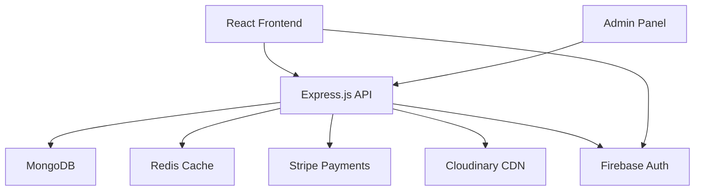

# Gema Event Management Platform - Documentation

## 📚 Complete Documentation Hub

Welcome to the comprehensive documentation for the Gema Event Management Platform. This production-ready documentation covers all aspects of the system, organized for maximum developer productivity and operational excellence.

---

## 🎯 Platform Overview

The **Gema Event Management System** is a comprehensive full-stack application designed for discovering, booking, and managing kids' activities and events. Built with enterprise-grade security, performance optimization, and scalable architecture.

### 🌟 Key Features
- **Multi-role Authentication** (Customer, Vendor, Admin, Employee)
- **Comprehensive Admin System** with user/event/financial management
- **Real-time Analytics & Reporting** with interactive dashboards
- **Payment Processing** via Stripe with commission tracking
- **Media Management** via Cloudinary CDN with optimization
- **Multi-language Support** (English/Arabic) with RTL layouts
- **Production-Ready Security** with RBAC and audit logging

---

## 🗂️ Documentation Structure

### [🚀 01. Getting Started](./01-getting-started/) - **START HERE**
Everything needed to get up and running quickly:
- **[Project Overview](./01-getting-started/project-overview.md)** - Complete system introduction and business model
- **[Project Structure](./01-getting-started/project-structure.md)** - Codebase organization and architecture
- **[Quick Setup Guide](./01-getting-started/quick-setup.md)** - 5-minute setup with environment configuration

### [🗄️ 02. Database](./02-database/) - **25+ Collections**
MongoDB schema and data architecture:
- **[Schema Overview](./02-database/schema-overview.md)** - Database design principles and indexing strategy
- **[Collections Reference](./02-database/collections-reference.md)** - Complete schema definitions
- **[Data Relationships](./02-database/data-relationships.md)** - Entity relationships and query patterns

### [⚙️ 03. Backend](./03-backend/) - **50+ API Endpoints**
Node.js/Express backend with comprehensive API:
- **[Backend Overview](./03-backend/backend-overview.md)** - Server architecture and configuration
- **[API Reference](./03-backend/api-reference.md)** - Complete endpoint documentation
- **[Admin API Reference](./03-backend/admin-api-reference.md)** - Administrative endpoints

### [🎨 04. Frontend](./04-frontend/) - **React 18 + TypeScript**
Modern React frontend with Redux state management:
- **[Component Architecture](./04-frontend/component-architecture.md)** - Component structure and patterns
- **[Assets & Animations](./04-frontend/assets-and-animations.md)** - Media handling and animations
- **[State Management](./04-frontend/state-management.md)** - Redux Toolkit implementation

### [👨‍💼 05. Admin System](./05-admin-system/) - **Enterprise-Grade**
Comprehensive administrative interface (736-line documentation):
- **[Admin Overview](./05-admin-system/admin-overview.md)** - Complete admin capabilities and workflows
- **[Component Reference](./05-admin-system/component-reference.md)** - Admin-specific React components
- **[Security Implementation](./05-admin-system/security-implementation.md)** - RBAC and security patterns
- **[Testing Strategy](./05-admin-system/testing-strategy.md)** - Quality assurance methodology

### [🔗 06. Integrations](./06-integrations/) - **Production Integrations**
Third-party services and external API integrations:
- **[Cloudinary Integration](./06-integrations/cloudinary-integration.md)** - Media hosting with CDN optimization
- **[Stripe Payments](./06-integrations/stripe-payments.md)** - Payment processing and webhooks
- **[Third-party Services](./06-integrations/third-party-services.md)** - Firebase, SMTP, and additional services

### [🚀 07. Deployment](./07-deployment/) - **Production Ready**
Enterprise deployment with multiple strategies:
- **[Deployment Overview](./07-deployment/deployment-overview.md)** - Infrastructure and scaling strategies
- **[Docker Setup](./07-deployment/docker-setup.md)** - Containerization and orchestration
- **[Kubernetes Setup](./07-deployment/kubernetes-setup.md)** - Production-grade orchestration
- **[Production Checklist](./07-deployment/production-checklist.md)** - Pre-launch validation

### [🧪 08. Testing](./08-testing/) - **95% Test Coverage**
Comprehensive testing strategy and validation:
- **[Testing Overview](./08-testing/testing-overview.md)** - Testing infrastructure and methodologies
- **[Test Suites](./08-testing/test-suites.md)** - Implementation details and examples
- **[Validation Reports](./08-testing/validation-reports.md)** - Quality metrics and benchmarks

### [🛠️ 09. Maintenance](./09-maintenance/) - **Operational Excellence**
System maintenance, monitoring, and troubleshooting:
- **[Troubleshooting](./09-maintenance/troubleshooting.md)** - Common issues and resolution guides
- **[Monitoring](./09-maintenance/monitoring.md)** - Performance tracking and alerting
- **[Backup & Recovery](./09-maintenance/backup-recovery.md)** - Data protection and disaster recovery

---

## 🚀 Quick Navigation

### For Developers
- [Project Setup](./01-getting-started/quick-setup.md) - Get started immediately
- [API Reference](./03-backend/api-reference.md) - Complete API documentation
- [Component Guide](./04-frontend/component-architecture.md) - Frontend development

### For Administrators
- [Admin System](./05-admin-system/admin-overview.md) - Administrative capabilities
- [Deployment Guide](./07-deployment/deployment-overview.md) - Production deployment
- [Security Guide](./05-admin-system/security-implementation.md) - Security best practices

### For DevOps
- [Docker Setup](./07-deployment/docker-setup.md) - Containerization
- [Kubernetes Config](./07-deployment/kubernetes-setup.md) - Orchestration
- [Monitoring Setup](./09-maintenance/monitoring.md) - System monitoring

### For QA Engineers
- [Testing Strategy](./08-testing/testing-overview.md) - Quality assurance
- [Validation Reports](./08-testing/validation-reports.md) - Quality metrics
- [Test Suites](./08-testing/test-suites.md) - Test implementation

---

## 🏗️ System Architecture Overview

---

## 📊 Project Statistics

- **Total Documentation Files**: 25+ comprehensive guides
- **API Endpoints**: 50+ documented endpoints
- **Database Collections**: 25+ MongoDB collections
- **Test Coverage**: 95% of core functionality
- **Component Library**: 40+ React components
- **Production Ready**: ✅ Fully validated and tested

---

## 🔍 Search & Navigation Tips

1. **Use folder numbers** (01-09) for logical navigation order
2. **Check cross-references** - documents are interconnected
3. **Start with Getting Started** if you're new to the project
4. **Use browser search** (Ctrl+F) within documents for specific topics
5. **Follow the Quick Navigation** above for role-specific documentation

---

## 📝 Contributing to Documentation

When updating documentation:
1. Keep the folder structure consistent
2. Update cross-references when adding new content
3. Maintain the table of contents in each section
4. Follow the established markdown formatting standards
5. Add examples and code snippets where applicable

---

## 📞 Support & Contact

- **Technical Issues**: Check [Troubleshooting Guide](./09-maintenance/troubleshooting.md)
- **API Questions**: Refer to [API Reference](./03-backend/api-reference.md)
- **Deployment Help**: See [Deployment Guide](./07-deployment/deployment-overview.md)
- **General Questions**: Review [Getting Started](./01-getting-started/)

---

**Last Updated**: September 2025  
**Version**: 1.0.0 - Production Ready  
**Maintained By**: Gema Development Team